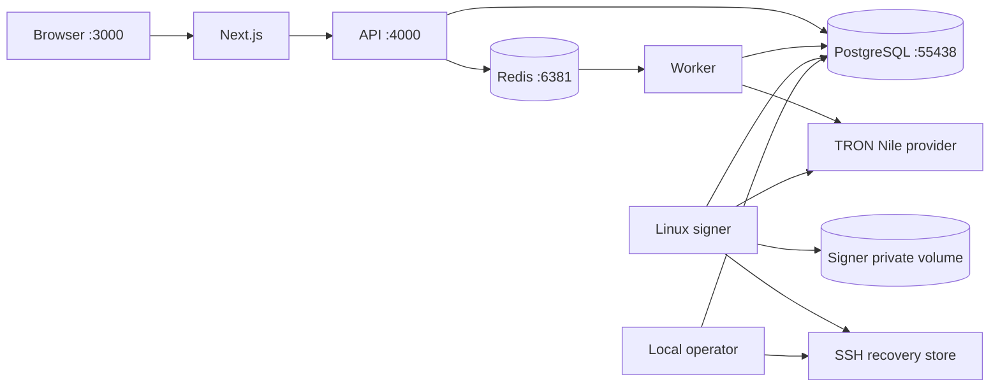
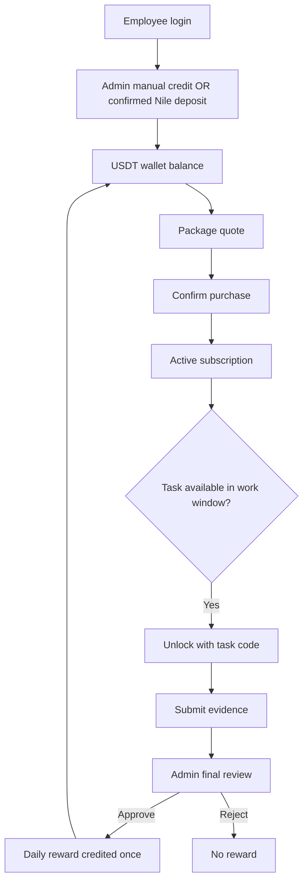

# Local Nile development and workshop

This setup starts the implemented backend services on Linux containers and the
frontend on the host. It is for a local demonstration on TRON Nile, not a
production deployment or a production recovery procedure.

## Start and stop

Install Node.js 24 and pnpm 11, start Docker Desktop with Linux containers, then
run from the repository root:

```sh
pnpm install --frozen-lockfile
pnpm dev
```

The first run downloads dependencies and builds the runtime image. Later runs
reuse Docker layers, rebuild the backend, apply pending migrations and reconcile
the local financial runtime before opening it for writes. Wait for Next.js to
report ready, then open `http://localhost:3000`.

| Command                           | Behavior                                                                                      |
| --------------------------------- | --------------------------------------------------------------------------------------------- |
| `pnpm dev`                        | Prepare/start all local backend services, then run Next.js in the foreground.                 |
| `pnpm dev:setup`                  | Prepare/start backend services without starting Next.js.                                      |
| `pnpm dev:services`               | Same backend setup/rebuild; useful after editing API code.                                    |
| `pnpm dev:status`                 | Show the containers belonging to this local Compose project.                                  |
| `pnpm dev:stop`                   | Stop all local containers without deleting volumes.                                           |
| `pnpm --filter @template/web dev` | Start only Next.js after backend services are running.                                        |
| `pnpm dev:apps`                   | Original Turbo app development command; requires a separately configured backend environment. |

Ctrl+C in `pnpm dev` stops its web process and the API, worker, signer, operator
and recovery service. PostgreSQL and Redis stay running. Use `pnpm dev:stop` to
stop those too. Stop the foreground web terminal separately if using
`pnpm dev:stop` while the frontend is running.

Next.js reloads frontend edits. Containerized backend services use compiled code;
run `pnpm dev:services` after backend edits. Do not start a native API on port
4000 alongside the containerized API.

## What setup generates

- A separate `oscar-dev` Compose project with its own database and key volumes.
- Root `.env` and `apps/web/.env.local`; a pre-existing root `.env` is backed up on
  the first initialization.
- Missing independent auth secrets and random local account passwords.
- Admin `admin@oscar.test` and employee `employee@oscar.test`, seeded as active
  accounts only when their emails do not already exist.
- Separate API, worker, signer and operator database logins. Runtime logins have
  no superuser, role-creation, database-creation or RLS-bypass privileges.
- A Nile treasury wallet, encryption key, SSH identities and pinned recovery
  host key. Private keys are not exposed to the browser or printed by setup.
- A database dump before each financial runtime restart. The local operator uses
  the existing fence, inventory, reconciliation and acknowledgment commands.

Generated host files live at `%LOCALAPPDATA%/OSCAR/oscar-dev` on Windows, or
`~/.local/share/OSCAR/oscar-dev` on Linux/macOS. Windows setup restricts access to
that directory to the current user. `credentials.json` contains the local login
passwords. Do not commit or share that directory, `.env`, or email previews.

Custody files live in Linux Docker volumes with separate owners. The API and
worker do not mount signer keys. The SSH recovery store has its own volume;
the local operator retains an independent encryption-key copy. These volumes
share the developer's Docker host and are not an independent disaster-recovery
host for production.

The root environment contains Linux custody paths for the container setup.
Those paths are not native Windows paths. Migrations use the generated migrator
connection internally; the root `DATABASE_URL` uses the restricted API login.
Use `pnpm dev:setup` to apply migrations in this setup.

After successful initial setup, subsequent starts read root `.env` edits and
update container configuration. This script only accepts `TRON_NETWORK=TRON_NILE`.
Existing account passwords are not reset on every run, and wallets/keys are not
regenerated. Do not delete private host files or Docker volumes to troubleshoot.

## Services

| Service    | Local access / responsibility                                              |
| ---------- | -------------------------------------------------------------------------- |
| Next.js    | `http://localhost:3000`; employee and admin UI.                            |
| API        | `http://localhost:4000/api/v1`; authentication, domain commands and reads. |
| PostgreSQL | `127.0.0.1:55438`; persistent application and financial records.           |
| Redis      | `127.0.0.1:6381`; withdrawal wakeups, with AOF and no eviction.            |
| Worker     | Deposit indexing/verification and withdrawal scheduling.                   |
| Signer     | Address provisioning, treasury sweeps and withdrawal payout processing.    |
| Recovery   | Internal SSH service for encrypted recovery records.                       |
| Operator   | Internal local admission and recovery commands.                            |



## Workshop from the website

Open the passwords in `credentials.json`. Use separate browser profiles or a
private window for admin and employee sessions.

1. Log in as the admin at `/admin/auth/login`, then open `/admin/deposits`.
   Use the manual-credit dialog to select the employee, enter an amount such as
   `100`, a reason and a reference, review and confirm. This is an internal ledger
   credit; it does not send tokens on TRON.
2. Log in as the employee at `/employee/auth/login` and open `/employee/packages`.
   The S1 package costs `60` in the current initial catalog. Review its purchase
   quote and confirm. A successful purchase records the debit and subscription.
3. Open `/employee/deposit` and request the deposit address. A first request can
   show provisioning before `READY`. The signer generates the private key,
   encrypts it and obtains the recovery-store acknowledgment before exposing
   the ready address.
4. As admin, use `/admin/tasks` to create/publish a task and manage its codes.
   As employee, use `/employee/tasks` to unlock and submit the available task
   with the required evidence. Availability depends on an active subscription
   and the server's work window: Monday–Friday, 12:00–18:00 Asia/Baghdad.
5. Review the submission as admin. An approval credits the package's daily
   reward once; submission alone does not earn a reward. Check the employee's
   connected wallet views and deposit history after financial actions.



The wallet holds exact USDT amounts; there is no separate points currency or
employee-to-employee transfer feature. Main employee/admin dashboard totals and
the withdrawal screens are still fixtures. Employee withdrawal-address UI and
withdrawal API integration need their planned frontend work; starting services
does not complete those screens. Employee management, settings and audit screens
also contain fixture behavior. Use connected package, deposit and task views for
the workshop.

## TRON testing without real funds

The provider is `https://nile.trongrid.io`, using the public-testnet profile, and
the configured test USDT contract is `TXYZopYRdj2D9XRtbG411XZZ3kM5VkAeBf`.
Generated wallets initially have no on-chain liquidity. Creating a wallet and
adding a manual ledger credit do not fund it.

For a real Nile deposit test, obtain test tokens in a separate Nile wallet and
send test USDT from that wallet to the employee's ready deposit address. The
worker must discover and verify the transfer and its confirmations before the
wallet ledger is credited. Check `/employee/deposit` and `/admin/deposits` for
the receipt; copying an address alone is not proof of a successful deposit.

TRON documents free test TRX and test-token funding through the
[Nile faucet](https://nileex.io/join/getJoinPage) and developer bot in its
[test-token guide](https://developers.tron.network/docs/getting-testnet-tokens-on-tron).
Use Nile for the sending wallet and the same test USDT contract. A sweep/payout
also needs the appropriate source tokens and network resources/TRX; an empty
treasury cannot pay a withdrawal. The generated treasury public address is in
root `.env` as `TRON_TREASURY_ADDRESS`.

This setup does not claim that a new on-chain deposit, sweep or withdrawal has
completed, and it does not enable the special P08 acceptance harness. Complete
withdrawal testing still requires funded test wallets and the appropriate
backend workflow; the current website withdrawal screens cannot initiate that
workflow.

## Troubleshooting

Check `pnpm dev:status`, then inspect logs with PowerShell:

```powershell
docker compose --env-file "$env:LOCALAPPDATA/OSCAR/oscar-dev/compose.env" -f compose.dev.yaml logs --tail 80 api worker signer
```

On Linux/macOS use `~/.local/share/OSCAR/oscar-dev/compose.env` as the env-file
path. Do not print the resolved Compose configuration or private configuration
files into a shared terminal capture.

- Docker unavailable: start Docker Desktop in Linux-container mode.
- Port occupied: check ports 3000, 4000, 55438 and 6381 and stop the conflicting
  process you own. This setup uses fixed ports and does not stop other projects.
- API ready but address stays provisioning: inspect signer/recovery logs and Nile
  connectivity. Keep the financial guards enabled and rerun setup after fixing
  the cause.
- Task unavailable: verify the subscription, published task, code and server work
  window; changing the browser clock does not change server policy.
- New account email: open the newest HTML preview under `.local-emails`.

The original `compose.yaml` remains available for its existing deployment paths;
the one-command local setup uses `compose.dev.yaml` exclusively.
