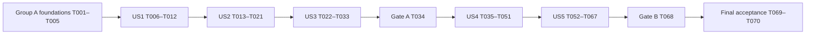

# Tasks: P08 Withdrawal Reservation, Automatic Payout, and Recovery Backend

**Roadmap Phase**: P08 - Withdrawal Reservation, Automatic Payout, and Recovery Backend

**Feature Directory**: `specs/008-withdrawals-payout-recovery` (verified pointer, specification and branch).

**Inputs**: [spec.md](spec.md), [plan.md](plan.md), [research.md](research.md), [data-model.md](data-model.md), [HTTP contract](contracts/withdrawals.md), [protected runtime contract](contracts/payout-runtime.md), [quickstart.md](quickstart.md), constitution 1.0.0 and all eight engineering guides.

**Execution**: TASKS generates this list only. A later IMPLEMENT request must select exact task IDs or a dependency-safe batch. All checkboxes below are unexecuted. Preserve the 16 checked built-in requirements items and 38 unchecked custom checklist items; generation does not approve requirements. Required requirements review and read-only ANALYZE precede implementation under the workflow contract.

**Scope**: One P08 task set. Group A (US1–US3) must pass T034 before **any** Group B production/schema/contract/private-fixture/test work (US4–US5). T068 and final acceptance must pass before P09. Internal phases are task groups, not additional roadmap phases. Reuse accepted P01–P07 foundations and recorded P06/P07 evidence; do not repeat toolkit setup or require the superseded separate CONVERGE stage.

**Frontend exception**: T037 adds exactly the owner-approved `WITHDRAWAL_SETTLEMENT: "سحب مكتمل"` map entry. Preserve all other labels, screens, routes, controls and styles. No withdrawal UI wiring, new confirmation surface or P10 address/settings endpoint is included.

**Tests and review**: Actual automated files are required. Use real migrated PostgreSQL for money/roles/rollback/races, isolated Redis for wakeups/lifecycle, built Linux/private archive/escrow for custody and controlled opt-in testnet for payout finality. Ordinary tests fake email/provider network boundaries and never contact a live signer. Apply clean-code-guard after substantive production edits, security-best-practices for sensitive TypeScript work, test-guard for changed tests, and docs-guard for changed documentation; revisit the owning engineering guides per batch. The label-only change requires its web instructions/caller review and affected checks; use React/Playwright skills only if their actual boundary is affected. Missing infrastructure or authorization leaves the relevant task/gate incomplete.

## Format and ownership

Each task uses `- [ ] Tnnn [P]? [USn]? Description`, exact repository-relative paths and explicit prerequisite IDs. `[P]` permits concurrent work only after listed dependencies pass, with separate file ownership. Shared schema, ledger, service, mapper, entrypoint, configuration and fixture writers stay sequential. Proposed paths are implementation targets, not claims that the files already exist. Migration timestamps below are proposed new forward directories; preserve every applied migration. “Commit the enum migration” means its PostgreSQL migration transaction commits, not an unrequested Git commit.

## Phase 1: Selected-phase prerequisites

Context is already verified during TASKS: the pointer/spec select P08, the populated constitution applies, P06/P07 acceptance is recorded, and the current branch is `008-withdrawals-payout-recovery`. No implementation task is added to recreate those checks. At each future batch, confirm these inputs and the working tree still match, read affected source/callers and report missing services before editing. The custom requirements checklist remains pending its authorized pre-implementation review.

## Phase 2: Group A shared foundations

**Goal**: Establish reserve/release-compatible wire and persistence boundaries without payout implementation.

- [x] T001 [P] Create strict Group A destination/proof, quote/acceptance, status/history and admin extension/rejection schemas in `packages/contracts/src/withdrawals/withdrawal.schema.ts` and export them in `packages/contracts/src/index.ts`; reuse existing money, funded-allocation, pagination, confirmation/reason and request-key schemas, including exact counted-hour commands, nonnegative remainingCountedMilliseconds integer text and six-decimal truncated remainingCountedHours display from one duration result, and all future active public states. Do not add SETTLE/origin/SETTLED yet. Dependencies: none. Refs: FR-002–028.
- [x] T002 [P] Add Destination, append-only `WithdrawalDestinationAudit`, singleton Policy, immutable Quote, Request and append-only Action models in `packages/database/prisma/schema.prisma` and `packages/database/prisma/migrations/20261008000000_p08_withdrawal_reservations/migration.sql`; seed initial 16/500/2100 terms without overwriting existing policy, enforce all-active uniqueness, composite ownership/reservation identities, permanent quote identity, immutable snapshots and version/release agreement. Enforce employee-bound proof-event identity, matching issuance/consumption, unique generation/kind and committed destination version, and append-only audit protection. Add narrow API domain/safe-release, worker hint-only and protected conditional-claim grants/guards; no private attempt, key or lane. Dependencies: none. Refs: FR-005–007, FR-009–028.
- [x] T003 Add real fresh/populated/repeated-deploy and direct-SQL constraint/role tests in `packages/database/tests/integration/p08-withdrawals-constraints.integration.test.ts` and `packages/database/tests/integration/p08-withdrawals-upgrade.integration.test.ts`; update `packages/database/tests/schema-contract.test.ts` and `packages/database/tests/integration/migration.integration.test.ts`. Preserve predecessor IDs/ledger/history and test all active states, immutable destination/terms, employee-bound append-only proof audits with matching unique events, nonnegative sources and cross-row write-side rollback guards. Dependencies: T002. Refs: FR-014–019, FR-027–028, FR-042.
- [x] T004 Create minimal admitted real-database fixtures with separate-client race barriers in `apps/api/src/modules/withdrawals/testing/withdrawal-fixtures.ts` and `apps/api/src/modules/withdrawals/testing/withdrawal-authority-fixtures.ts`; reuse existing financial/runtime helpers, never broaden production grants from rejection-test scaffolding. Exclude `src/modules/withdrawals/testing/**` in `apps/api/tsconfig.build.json` and retain the protections in `scripts/assert-build-output.mjs`. Dependencies: T002. Refs: FR-014–028, FR-042.
- [x] T005 [P] Add strict wire tests in `packages/contracts/src/withdrawals/withdrawal.schema.test.ts` and extend `packages/contracts/src/wallet/wallet.schema.test.ts` for malformed/privileged inputs, canonical decimal precision, partial funding, bounded histories, null/pending/saved states, safe allowlists, zero/one-millisecond countdown shapes and literal-false execution readiness. Dependencies: T001. Refs: FR-002–004, FR-005–019, FR-024, FR-042.

**Checkpoint**: Foundations remain Group A only. Review/run their owning checks with the first dependent batch; generated schemas or mocked transactions alone do not pass a gate.

## Phase 3: US1 — Confirm a first fixed recipient (P1, Group A)

**Goal**: Save one exact first address through the newest dedicated email proof with truthful pending/delivery state.

**Independent test**: With real PostgreSQL, current authenticated sessions and a controlled email boundary, race issuance and consumption; only the committed latest valid proof can save the first address once. Expired/superseded/wrong-user/wrong-address/replayed proof, invalid issuance and delivery failure preserve the required authority and create no reservation. Verify through the actual HTTP boundary as well as persisted state.

- [x] T006 [US1] Add validated address-proof/quote settings in `apps/api/src/core/config/withdrawal.config.ts`, same-origin account-fragment confirmation target in `apps/api/src/core/config/email.config.ts` and placeholders in `.env.example`; add `apps/api/src/core/config/withdrawal.config.test.ts` and extend `apps/api/src/core/config/email.config.test.ts`. Use validated contract TTL/cooldown ranges and initial defaults (proof 1800 seconds, cooldown 60 seconds, quote 600 seconds), HTTPS in production and no credentials in examples. Dependencies: T001, T002, T005. Refs: FR-005–007, FR-009, FR-042.
- [x] T007 [P] [US1] Author `apps/api/src/modules/withdrawals/withdrawal-destination.integration.test.ts` with actual issuance/consumption races, rejected issuance unchanged, supersession committed before I/O, expiry/replay/mismatch, persisted cooldown, late/unknown/rejected delivery, immutable first-save, lost reply and revoked-session denial; assert hash-only proof storage and absence of proof secrets from outputs, exactly one matching `WithdrawalDestinationAudit` event per committed issuance/consumption, zero extra events for replay/rejection/losing races and real audit-write rollback of supersession or save/clear. Exercise nondefault validated TTL/cooldown and preserved saved expiry/next-issuance instants after configuration changes. Dependencies: T003, T004, T005, T006. Refs: FR-003, FR-005–007, FR-042; C2.
- [x] T008 [P] [US1] Add `apps/api/src/infrastructure/email/templates/withdrawal-confirmation.template.ts`, extend `apps/api/src/infrastructure/email/email.service.ts` and its tests, and extend `apps/api/src/infrastructure/email/email-delivery.ts` and `apps/api/src/infrastructure/email/email-delivery.test.ts` to suppress/reject ordinary local HTML preview retention for this credential. Reuse dispatch preflight and generation-bound ACKNOWLEDGED/REJECTED/UNKNOWN semantics; an acknowledgement is not mailbox delivery. Prove no token/link in previews or logs, and no fake successful first save. Dependencies: T006. Refs: FR-005–007, FR-042; C2.
- [x] T009 [US1] Implement `apps/api/src/modules/withdrawals/withdrawal-destination.service.ts` using current server session authority and a dedicated random 32-byte hashed user/action/address/generation proof; accepted issuance supersedes older authority before email I/O, failed issuance changes nothing, and late delivery can update only its matching generation. Write `WithdrawalDestinationAudit` issuance/resend and matching consumption events in the same transactions as their authority changes, with server employee actor/time and no token/hash/full URL; rejected commands/replay/losing races add no event and audit failure rolls back the transition. Compute persisted expiry/next-issuance instants from validated configuration at issuance. Atomically consume/clear the latest proof and save the exact first destination once; never revive older proofs or permit employee overwrite. Dependencies: T007, T008. Refs: FR-003, FR-005–008; C2.
- [x] T010 [US1] Create thin destination/status HTTP owners in `apps/api/src/modules/withdrawals/withdrawals.routes.ts`, `apps/api/src/modules/withdrawals/withdrawals.controller.ts`, `apps/api/src/modules/withdrawals/withdrawals.service.ts`, `apps/api/src/modules/withdrawals/withdrawals.mapper.ts` and `apps/api/src/modules/withdrawals/withdrawals.errors.ts`; compose in `apps/api/src/router.ts` and update `apps/api/src/infrastructure/openapi/openapi.ts`. Require current USER/session, strict shared input, CSRF on issuance/consumption POST, bounded existing limiters and no-store safe projections; GET never consumes proof and imports never start private runtimes. Dependencies: T009. Refs: FR-003–007.
- [x] T011 [US1] Add `apps/api/src/modules/withdrawals/withdrawals-http.integration.test.ts` and extend `apps/api/src/infrastructure/openapi/openapi.test.ts` for actual app/auth/CSRF/session/ownership/rate/input boundaries, truthful pending/saved/delivery reads, safe error/envelope contracts and credential redaction. Confirm the account-fragment link has no P08 browser consumer or hidden confirmation success. Dependencies: T010. Refs: FR-003–007, FR-042.
- [x] T012 [US1] Run focused contract/config/email/destination/HTTP tests and affected auth/session regressions, review production/security/test/doc changes against the guides, and record fresh commands/results or missing services in `specs/008-withdrawals-payout-recovery/quickstart.md`. Fix US1 findings before marking its tasks complete; passing US1 is partial backend work. Dependencies: T003, T005, T011. Refs: FR-042, SC-001; C2.

## Phase 4: US2 — Reserve an exact eligible gross amount (P1, Group A)

**Goal**: Quote current authoritative terms and atomically reserve one accepted gross amount with permanent business identity.

**Independent test**: Using the saved US1 destination and a migrated real database, gross 100 at 2100 bps produces fee 21/net 79; paid 70 non-referral + 30 referral reserves 70/10 for gross 80. Free/exact expiry cannot withdraw locked referral funds. Concurrent devices/purchase, new/missing request keys, stale material facts and a real failure after a dependent write leave one entire valid operation or none.

- [x] T013 [P] [US2] Add exact policy vectors in `apps/api/src/modules/withdrawals/withdrawal-policy.test.ts`, extending `apps/api/src/core/financial/money.test.ts` only for changed shared behavior: 16/500 and ±one micro, fee floor/conservation, zero-net 10000-bps rejection, representable bounds, unsupported syntax, paid versus Free/exclusive expiry and partial nonaccepting previews. Dependencies: T005, T012. Refs: FR-002, FR-009–013, FR-017–019.
- [x] T014 [P] [US2] Author `apps/api/src/modules/withdrawals/withdrawal-reservation.integration.test.ts` and `apps/api/src/modules/withdrawals/withdrawals-concurrency.integration.test.ts` around observable real service/database outcomes: 70/30→70/10 sources, immutable terms, quote expiry/material staleness including a nondefault validated TTL and unchanged saved expiry after configuration changes, one active request in every state, device/purchase races, same/fresh/missing key replay and dependent-write rollback. Use independent connections/barriers and inspect request/action/posting/source balances together. Dependencies: T003, T004, T005, T012. Refs: FR-009–019, FR-042.
- [x] T015 [US2] Implement `apps/api/src/modules/withdrawals/withdrawal-quote.service.ts` using existing exact money and subscription eligibility/snapshots: current paid fee or versioned Free policy, inclusive gross bounds, positive net, non-referral-first eligible allocation, destination/version and validated configured quote TTL, initially 600 seconds; derive immutable expiry at creation and never recompute it after configuration changes. Persist immutable reviewed material facts and expose partial allocation/top-up without accepting unfunded or forged terms. Dependencies: T013, T014. Refs: FR-009–013, FR-017–019.
- [x] T016 [US2] Implement `apps/api/src/modules/withdrawals/withdrawal-reservation.service.ts` with the existing admitted `LedgerService.runInTransaction`/withdrawal reservation primitive: reread current session/restrictions/entitlement/policy/destination/quote, lock in the existing financial order, and atomically write gross allocation, immutable accepted snapshots, 72-counted-hour original/current due and normalized dispatch, request and action. No email/Redis/provider I/O inside the transaction or nested ledger transaction. Dependencies: T015. Refs: FR-003, FR-014, FR-016–020.
- [x] T017 [US2] Complete replay/conflict handling in `apps/api/src/modules/withdrawals/withdrawal-reservation.service.ts` and `apps/api/src/modules/withdrawals/withdrawals.errors.ts`: permanently unique accepted quote returns the original reservation/request even after closure, while actor/operation/key/payload bindings distinguish valid replay from conflict. Rejected/stale terms never silently re-quote or change accepted terms; recognized financial transaction retries stay bounded and preserve identity. Dependencies: T016. Refs: FR-009, FR-013–016, FR-019.
- [x] T018 [US2] Extend `apps/api/src/modules/withdrawals/withdrawals.service.ts` and `apps/api/src/modules/withdrawals/withdrawals.mapper.ts` for bounded owner/admin status, request/outcome/history reads, server time and immutable terms; first add the shared remaining-counted-duration helper in `apps/api/src/core/business-calendar/business-clock.ts` with tests in `apps/api/src/core/business-calendar/business-clock.test.ts`. Derive remainingCountedMilliseconds (exact nonnegative integer text) and remainingCountedHours (truncated to at most six decimals) from that one result, clamp at zero and test one millisecond as `"1"`/`"0"`; extend `apps/api/src/modules/wallets/wallets.mapper.ts` and `packages/contracts/src/wallet/wallet.schema.ts` only as needed for safe source/reservation projections. Keep existing withdrawalExecutionReady false throughout Group A; no raw ORM/private records or unbounded lists. Dependencies: T017. Refs: FR-003–004, FR-019–021.
- [x] T019 [US2] Wire quote, acceptance and authorized owner/admin reads in `apps/api/src/modules/withdrawals/withdrawals.routes.ts`, `apps/api/src/modules/withdrawals/withdrawals.controller.ts`, `apps/api/src/router.ts` and `apps/api/src/infrastructure/openapi/openapi.ts`; preserve current authority, CSRF, optional validated financial request-key headers, strict schemas, ResponseHelper and documented safe conflict statuses. Expose no signing, manual completion, hold or employee cancellation endpoint. Dependencies: T018. Refs: FR-003–004, FR-009–019.
- [x] T020 [US2] Extend `apps/api/src/modules/withdrawals/withdrawals-http.integration.test.ts`, `apps/api/src/modules/wallets/wallet-projections.integration.test.ts` and `apps/api/src/modules/subscriptions/subscription-purchase.integration.test.ts` for quote/acceptance outcomes, owner/admin pagination/privacy, withdrawal-only history access, task-only restriction allowance, purchase spending only unreserved sources, accepted-request continuation after expiry, exact zero/one-millisecond countdown fields and truthful readiness. Complete T014's real race/rollback assertions against the composed services. Dependencies: T019. Refs: FR-003–004, FR-014–021, FR-026, FR-042.
- [x] T021 [US2] Run focused policy/reservation/concurrency/HTTP tests and affected ledger/subscription/wallet/schema regressions, apply production/security/test/doc review and record actual commands/results in `specs/008-withdrawals-payout-recovery/quickstart.md`. Resolve shared financial findings without reimplementing completed foundations. Dependencies: T020. Refs: FR-042, SC-002–004.

## Phase 5: US3 — Schedule and safely stop unsent work (P1, Group A)

**Goal**: Make accepted deadlines repairable, extensions versioned and only safely unsent cancellation refundable.

**Independent test**: With actual PostgreSQL/Redis, prove Friday 12:00→Wednesday 12:00, weekend acceptance and Saturday-00:00 due→Monday dispatch; positive extensions use the current due instant. Separate-client rejection/ban/block/future-address-helper versus admitted non-signing conditional claim chooses one safe result. Publication loss, stale jobs, duplicate workers and restart preserve the request and reservation; the worker can write only discovery hints.

- [x] T022 [P] [US3] Add `apps/api/src/modules/withdrawals/withdrawal-clock.test.ts` and extend `apps/api/src/core/business-calendar/business-clock.test.ts` for affected calendar boundaries; the shared remaining-duration helper is already implemented/tested in T018 before reads. Reuse the existing Baghdad deadline/extension/dispatch functions; test exact fractional positive hours, six-decimal truncated remaining display, host-time independence, Friday/weekend/Saturday cutoff, original versus current due and no elapsed-hour substitution. Dependencies: T021. Refs: FR-020–024.
- [x] T023 [P] [US3] Author `apps/api/src/modules/withdrawals/withdrawal-cancellation.integration.test.ts` for exact original-source release once, rejection/extension replay and stale versions, restriction versus cancellation/claim races, expiry continuation, task-only restriction and real dependent-write rollback. Use the future-address cancellation helper directly, with no P10 endpoint. Dependencies: T004, T021. Refs: FR-008, FR-024–028, FR-042.
- [x] T024 [US3] Implement positive counted-hour extension and safe rejection in `apps/api/src/modules/withdrawals/withdrawals.service.ts` plus the focused same-transaction helper `apps/api/src/modules/withdrawals/withdrawal-cancellation.service.ts`; require current ADMIN/session, expected version, confirmation/reason and payload-bound action identity. Preserve original due/terms, increment schedule version/reset hint on extension and atomically release recorded sources/state/action once only while safely SCHEDULED. Dependencies: T022, T023. Refs: FR-024–028.
- [x] T025 [US3] Adapt the outer transaction in `apps/api/src/modules/users/employee-restrictions.service.ts` to the admitted financial boundary and invoke `apps/api/src/modules/withdrawals/withdrawal-cancellation.service.ts` with its same transaction client for ban/withdrawal block. Preserve session revocation/account version/identity audit; no nested financial transaction, no expiry-only cancellation and no task-only withdrawal block. Provide the same safe cancellation primitive for later address replacement without changing an in-flight recipient. Dependencies: T024. Refs: FR-008, FR-026–028.
- [x] T026 [US3] Wire admin extension/rejection in `apps/api/src/modules/withdrawals/withdrawals.routes.ts`, `apps/api/src/modules/withdrawals/withdrawals.controller.ts`, `apps/api/src/router.ts` and `apps/api/src/infrastructure/openapi/openapi.ts`; extend `apps/api/src/modules/withdrawals/withdrawals-http.integration.test.ts` for current admin/reason/confirmation/CSRF/version conflicts and deny processing rejection, holds, manual completion and forged status changes. Dependencies: T025. Refs: FR-024–028, FR-042.
- [x] T027 [P] [US3] Add only BullMQ 5.81.5, direct ioredis 5.11.1 and dev testcontainers 12.1.0 in `apps/api/package.json`/`pnpm-lock.yaml`; configure Redis 7.4.11-alpine/no eviction in `compose.yaml`, typed bounded URL/prefix/batch/scan/retry/retention settings in `apps/api/src/core/config/withdrawal.config.ts` and safe `.env.example` placeholders/tests. Verify locked compatibility and pin the official Redis image digest at installation; no unrelated upgrade, production Redis fallback or signer Redis dependency. Dependencies: T006, T021. Refs: FR-022–023, FR-037, FR-042.
- [x] T028 [US3] Create disposable mapped-port Redis support in `apps/api/src/modules/withdrawals/testing/redis-harness.ts` and author `apps/api/src/modules/withdrawals/withdrawal-scheduler.integration.test.ts` for real PostgreSQL/Redis delivery/loss/restart, duplicate/stale versions and future-backoff preservation. Own and close all containers/Queue/Worker/clients on every result; never use developer Redis, forced exit or sleep-based calendar tests. Dependencies: T004, T027. Refs: FR-022–023, FR-042.
- [x] T029 [US3] Implement `apps/api/src/infrastructure/queue/withdrawal-wakeups.ts` and `apps/api/src/modules/withdrawals/withdrawal-scheduler.ts`: bounded postcommit wakeups and DB repair scan, revision-safe job IDs/retention and only null→server-time current-due SCHEDULED discovery hints. Recheck database admission/state/timing/version, leave future backoff unchanged, use BullMQ prefix rather than ioredis keyPrefix and separate bounded producer/consumer retry settings. Queue ownership never grants SIGNING/attempt/lane authority. Dependencies: T026, T028. Refs: FR-022–023.
- [x] T030 [US3] Compose injected producer publication in `apps/api/src/server.ts`, `apps/api/src/app.ts`, `apps/api/src/router.ts` and the owning reservation/extension services; publication failure after commit leaves accepted database truth intact and discoverable. Importing app/routes starts no socket/worker. The process closes its queue/client/database resources on startup failure and shutdown, with no detached money job. Dependencies: T029. Refs: FR-014, FR-022–024, FR-042.
- [x] T031 [US3] Extend existing `apps/api/src/worker.ts` with owned consumer and bounded fair discovery/repair cycles while preserving deposit reconciliation, financial mutation admission and shutdown. Do not compose production payout/signing. Complete real scheduler tests for missing publication, Redis/worker restart, duplicate workers, hint privacy and direct-SQL denial of protected transitions/private authority. Dependencies: T030. Refs: FR-022–023, FR-042.
- [x] T032 [US3] Complete `apps/api/src/modules/withdrawals/withdrawal-cancellation.integration.test.ts`, `apps/api/src/modules/withdrawals/withdrawal-scheduler.integration.test.ts` and `apps/api/src/modules/withdrawals/testing/withdrawal-authority-fixtures.ts` with a genuine admitted protected compare/claim boundary that moves the Group A claim marker conditionally but never signs or creates private attempt/key/lane/archive data. Race it against extension/rejection/ban/block/future address cancellation in the established admission→users→wallets→allocations→domain lock order; claim winner preserves funds/recipient, cancellation winner prevents claim. This is a test boundary, not a public or composed signer workflow. Dependencies: T025, T026, T031. Refs: FR-008, FR-023–028, FR-042.
- [x] T033 [US3] Run calendar/cancellation/scheduler/HTTP and affected restriction/session/deposit/ledger regressions with actual Redis/PostgreSQL, review source/test/security/lifecycle/build changes and record commands/results in `specs/008-withdrawals-payout-recovery/quickstart.md`. Assert extension versus old job, safe release versus claim, lost wakeup repair and worker authority from persisted outcomes. Dependencies: T032. Refs: FR-042, SC-005–006.

## Phase 6: Gate A — Reservation/scheduling acceptance

- [x] T034 Pass and record Gate A in `specs/008-withdrawals-payout-recovery/quickstart.md` using T003/T005/T012/T021/T033 evidence and the Group A command set below: actual fresh schema/upgrade/contract/unit/PostgreSQL/Redis tests, all active-state/source/rollback/calendar/claim-cancel/proof/replay cases, affected shared regressions, lint/types/build-output and completed applicable reviews. Record exit codes, discovered tests, fresh/cache provenance and missing services; unavailable required checks keep Gate A incomplete. Only a passed gate permits T035–T068; no P08 completion or P09 permission follows from this checkpoint. Dependencies: T003, T004, T005, T012, T021, T033. Refs: FR-001, FR-003–028, FR-042, SC-001–006.

## Phase 7: US4 — Automatically pay and settle the original net (P1, Group B)

**Goal**: Prepare one fixed protected payout, retain its original identity before send and settle only verified canonical-final success.

**Independent test**: After Gate A, exercise admitted protected service boundaries with real PostgreSQL and controlled provider/archive evidence: competing claims produce one attempt/source lane, unsigned/signed/TxID/archive/broadcast intent ordering survives lost replies, and only the exact original canonical-final net transfer commits one original-gross settlement. Wrong/nonfinal/malformed/failed evidence never settles. Production signer composition waits for US5 recovery admission; US4 service tests do not authorize live dispatch.

- [x] T035 [US4] Add the enum-only forward SQL `packages/database/prisma/migrations/20261008000100_p08_settlement_enums/migration.sql` for SETTLE, WITHDRAWAL_SETTLEMENT and SETTLED; ensure its migration transaction commits before any following migration consumes the new labels. Preserve applied history and existing enum values; no db:push/reset or Git commit is authorized. Dependencies: T034. Refs: FR-001, FR-034, FR-042.
- [x] T036 [US4] Extend `packages/database/prisma/schema.prisma` and `packages/database/prisma/migrations/20261008000200_p08_payout_settlement/migration.sql` with settlement allocation identity/time, immutable TreasuryPayoutKey and one WithdrawalAttempt per request, the unresolved network/token/source lane and coherent final-block floor. Enforce private attempt/unsigned/signed/TxID/archive/broadcast/finality agreement, guarded cross-row terminal writes, append-only actions/history and narrow signer/recovery grants; API/worker cannot write them. Supply the complete production SIGNING+attempt relation; unexplained Group A claim markers must fence/report, never receive fabricated payment backfills. Dependencies: T035. Refs: FR-023, FR-028–040.
- [x] T037 [US4] Extend settlement kinds/origin and additive nullable withdrawal terms in `packages/contracts/src/financial/financial.schema.ts`, `packages/contracts/src/wallet/wallet.schema.ts`, `packages/contracts/src/withdrawals/withdrawal.schema.ts`, `packages/contracts/src/index.ts` and affected schema tests. Add exactly `WITHDRAWAL_SETTLEMENT: "سحب مكتمل"` in `apps/web/src/features/employee/utils/ledger-presentation.ts`, after reading its web instructions/callers. Preserve all existing labels/package terms/UI, no casts, hidden rows or substitute origin; keep current execution readiness false until both gates and admitted configuration pass. Dependencies: T036. Refs: FR-004, FR-019, FR-034; owner decision 2026-10-08.
- [x] T038 [P] [US4] Extend `packages/database/tests/integration/p08-withdrawals-constraints.integration.test.ts`, `packages/database/tests/integration/p08-withdrawals-upgrade.integration.test.ts`, `packages/database/tests/schema-contract.test.ts` and `packages/database/tests/integration/migration.integration.test.ts` for committed enum ordering, populated Group A upgrade, ACTIVE→SETTLED versus RELEASED exclusivity, immutable private identity, unique attempt/lane, all cross-row write-side guards and real API/worker/operator SQL denials. Preserve original accepted/history IDs and test repeated deployment. Dependencies: T036, T037. Refs: FR-023, FR-028–040, FR-042.
- [x] T039 [P] [US4] Extend `apps/api/src/modules/withdrawals/testing/withdrawal-fixtures.ts` for minimal Group B test-only key/attempt/lane evidence and author `apps/api/src/modules/withdrawals/withdrawal-payout.integration.test.ts` for fixed-authority rejection, competing protected claims/source balance floors/caps and every durable lost-reply/crash boundary. Retain network doubles at the adapter boundary and real admitted PostgreSQL; no production fixture grants or new live credentials. Dependencies: T004, T036, T037. Refs: FR-029–033, FR-037–039, FR-042.
- [x] T040 [US4] Extend `apps/api/src/modules/ledger/ledger.types.ts`, `apps/api/src/modules/ledger/ledger.effects.ts`, `apps/api/src/modules/ledger/ledger.service.ts`, `apps/api/src/modules/ledger/ledger.mapper.ts`, `apps/api/src/modules/ledger/ledger-reconciliation.ts` and `apps/api/src/modules/ledger/ledger-reconciliation.evidence.ts` for one gross SETTLE: available delta zero, reserved/original-source and ownership delta negative gross, immutable net+fee=gross and no second employee debit/network cost. Preserve historical RESERVE reconciliation after its allocation becomes SETTLED, correction audit rules and the existing admitted transaction/lock order. Dependencies: T036, T037. Refs: FR-002, FR-019, FR-033–034.
- [x] T041 [US4] Implement `apps/api/src/modules/withdrawals/withdrawal-settlement.service.ts` to consume verified original-attempt final-success evidence and atomically commit request COMPLETED, one gross SETTLE, original allocation consumption, action/audit, settlement identity, original attempt CONFIRMED_SUCCESS, source-lane closure and monotonically advanced durable final-block floor. A raw provider acknowledgement or caller-supplied success cannot authorize the transaction; compare original immutable identity and check conditional state/affected rows. Dependencies: T040. Refs: FR-028, FR-033–034, FR-038.
- [x] T042 [US4] Extend `apps/api/src/modules/wallets/wallets.mapper.ts`, `apps/api/src/modules/wallets/wallet-history.query.ts` and `apps/api/src/modules/withdrawals/withdrawals.mapper.ts` for truthful full settlement history/detail/search/aggregates and safe public original TxID/blocker/term facts. Preserve package savedTerms and historical gross ownership accounting; never filter/mislabel SETTLE or expose private bytes/storage/credentials. Execution capability remains disabled pending both gates and current admitted configuration. Dependencies: T041. Refs: FR-004, FR-019, FR-033–035.
- [x] T043 [US4] Add `apps/api/src/modules/withdrawals/withdrawal-settlement.integration.test.ts` and extend existing ledger service/concurrency/reconciliation and `apps/api/src/modules/wallets/wallet-projections.integration.test.ts` for exact 100=79+21 original-source gross consumption, duplicate/concurrent final evidence, failed/nonfinal/wrong evidence denial and a real service failure after dependent writes rolling back every terminal effect. Verify historic reserve outcomes, approved label consumption and company resource costs excluded from employee accounting. Dependencies: T039, T042. Refs: FR-002, FR-028, FR-033–034, FR-042.
- [x] T044 [US4] Extend `apps/api/src/infrastructure/custody/encrypted-envelope.ts`, `apps/api/src/infrastructure/custody/key-storage.ts`, `apps/api/src/infrastructure/custody/recovery-store.protocol.ts` and concrete allowlists/config/tests for distinct TREASURY_KEY, PAYOUT_SIGNED_ATTEMPT and PAYOUT_BROADCAST_INTENT encrypted records. Extend `apps/api/src/core/config/custody.config.ts`, `apps/api/src/core/config/tron.config.ts` and safe `.env.example` placeholders for immutable payout-key identity/independent caps. Preserve sweep parsing and owner-only local/pinned independent archive/escrow access; payout records cannot be parsed as sweeps. Dependencies: T036, T037. Refs: FR-029–032, FR-039–041.
- [x] T045 [US4] Extend the bounded private-stdin command union in `apps/api/src/modules/treasury/treasury.intent.ts` and existing `apps/api/src/modules/treasury/treasury.cli.ts` for protected treasury-key provisioning. Derive the exact configured source from operator-only test/private input, retain immutable encrypted local and independent PUT/GET digest-acknowledged records before database binding, and test role/key mismatch/archive failure/replay/privacy. Preserve existing treasury commands; no new CLI, argv secret, API key import or fake employee address assignment. Dependencies: T044. Refs: FR-029–030, FR-039, FR-042.
- [x] T046 [US4] Implement fixed intent validation in `apps/api/src/modules/withdrawals/withdrawal-payout.intent.ts` and extend concrete supplied-source/recipient TRC-20 primitives in `apps/api/src/infrastructure/tron/tron-provider.ts` and `apps/api/src/infrastructure/tron/tron-signer.ts`; extend existing `apps/api/src/infrastructure/tron/signer-security.test.ts` and `apps/api/src/infrastructure/tron/tron-provider.test.ts`. Independently match request/owner/network/token/key/source/original recipient/version/net, sole transfer calldata/signature/TxID, native value/permission/expiry and company net/resource/fee caps; arbitrary signing and altered durable intent fail. Preserve sweep behavior/SDK version. Dependencies: T039, T045. Refs: FR-029–030, FR-042.
- [x] T047 [US4] Implement protected claim/preparation in `apps/api/src/modules/withdrawals/withdrawal-attempts.ts`: scan candidate IDs without request locks, enter current signer dispatch admission and the established lock order, then atomically claim due/unrestricted original terms with one attempt and one unresolved source lane. Admit coherent solidified token balance at/after the last completed lane final block, latest source activation/permissions/resources and recipient-specific simulation under independent caps. Shortage/outage/pause reserves funds and leaves bounded discoverable work; no automatic top-up. Dependencies: T036, T041, T046. Refs: FR-023, FR-028–030, FR-037–038.
- [x] T048 [US4] Complete original object/signing retention in `apps/api/src/modules/withdrawals/withdrawal-attempts.ts`: durably retain the sole unsigned body/TxID winner before local signing, then owner-only original signed bytes and acknowledged PAYOUT_SIGNED_ATTEMPT before database signed attachment. Keep file/archive/provider I/O outside transactions. Lost replies recover the exact winner; missing original body after committed identity stays UNKNOWN/RECOVERY_UNAVAILABLE with reservation/lane intact, never new reference block/expiry/TxID/attempt. Dependencies: T044, T047. Refs: FR-031–032, FR-035, FR-039.
- [x] T049 [US4] Complete send admission in `apps/api/src/modules/withdrawals/withdrawal-attempts.ts`: commit original-attempt UNKNOWN/broadcast admission, independently acknowledge matching PAYOUT_BROADCAST_INTENT, then send exactly the retained bytes. Missing acknowledgement forbids send; provider rejection/lost response remains uncertainty until original observation. Any eligible retransmission observes first and rechecks current admission/timing/source/caps, while preserving byte/TxID identity. Dependencies: T048. Refs: FR-031–032, FR-035, FR-037–038.
- [x] T050 [US4] Implement `apps/api/src/modules/withdrawals/withdrawal-reconciliation.ts` to independently verify original signed-body/TxID/network/token/source/recipient/net, solidified canonical block membership, execution receipt and exact transfer log before invoking `apps/api/src/modules/withdrawals/withdrawal-settlement.service.ts`. Wrong/nonfinal/disappearing/malformed/provider-ack evidence cannot settle or release. Observe retained attempts on weekends/new-dispatch pause and retain reservation on financial mutation fence. Dependencies: T041, T049. Refs: FR-028, FR-033–035, FR-038.
- [x] T051 [US4] Complete/run `apps/api/src/modules/withdrawals/withdrawal-payout.integration.test.ts`, `apps/api/src/modules/withdrawals/withdrawal-settlement.integration.test.ts`, protected adapter/storage/config tests and T038 upgrade/role tests; review production/security/test/docs and record actual focused/affected results in `specs/008-withdrawals-payout-recovery/quickstart.md`. Confirm all original-identity crash boundaries, canonical-success rollback and same-source lane exclusion. Production payout entrypoint remains uncomposed until US5 inventory/admission is safe. Dependencies: T038, T043, T050. Refs: FR-029–035, FR-037–039, FR-042, SC-007–008.

## Phase 8: US5 — Recover uncertainty without a second payment (P1, Group B)

**Goal**: Reconcile the original attempt, release only proved final failure, and resume after independent recovery of actual financial authority.

**Independent test**: Starting from US4 retained attempts, crash/restart/lost-ack tests reuse one signed body/TxID. UNKNOWN holds funds/user active slot/source lane despite ban/block or claimed expiry. Verified canonical-final CHAIN_FAILED releases original sources once with zero fee; a later request uses a fresh quote/current terms/new 72 counted hours. Built Linux and stale-snapshot tests prove independent key/archive/history admission, missing/conflicting authority fencing and no ordinary-process self-approval. Controlled payout-only testnet separately proves exact original-net finality/recovery.

- [x] T052 [US5] Author `apps/api/src/modules/withdrawals/payout-recovery.integration.test.ts` for lost sign/broadcast reply, original-byte/TxID recovery, UNKNOWN active reservation/source lane, restriction/address invariance, canonical-failure versus unproved absence and isolated stale-snapshot/missing-history/identity conflicts. Inspect real request/action/ledger/reservation/attempt/fence outcomes with controlled provider I/O; reserve built Linux cases for T061–T062 rather than substituting mocks. Dependencies: T034, T051. Refs: FR-028, FR-032, FR-035–040, FR-042.
- [x] T053 [US5] Extend `apps/api/src/modules/withdrawals/withdrawal-reconciliation.ts` and `apps/api/src/modules/withdrawals/withdrawal-settlement.service.ts` for automatic C1 failure only on verified canonical-final original CHAIN_FAILED with matching call/body, no Transfer logs and no conflicting potentially live attempt. In one admitted transaction release identical gross/source allocation once, close the request as FAILED and original attempt as CHAIN_FAILED, close its lane and advance the durable last-completed-lane final-block floor, and record failure/action with zero platform fee; company costs remain company costs. Extend `apps/api/src/modules/withdrawals/withdrawal-settlement.integration.test.ts` and `apps/api/src/modules/withdrawals/payout-recovery.integration.test.ts` for duplicate/failure-success conflicts, contradictory Transfer-log rejection, stale-floor/dependent-write rollback and fresh-current quote/new72h/no24h cooldown after failure. Provider absence, timeout, local/claimed expiry or lease loss stays UNKNOWN; no replacement payment. Dependencies: T052. Refs: FR-027–028, FR-035–036; C1.
- [x] T054 [US5] Implement original-attempt restoration in `apps/api/src/modules/withdrawals/withdrawal-recovery.ts` using the exact local/independent acknowledged signed and broadcast records plus immutable unsigned identity. Resolve observation before any same-byte re-send; missing/digest-conflicting/original-body/TxID/key evidence keeps funds/lane reserved and dispatch fenced or blocked. Never create another attempt/payment or infer failure from elapsed time; later valid canonical success still settles original terms despite expiry/ban/block/pause. Dependencies: T053. Refs: FR-028, FR-032, FR-035–040.
- [x] T055 [US5] Extend `apps/api/src/modules/custody/recovery-history.ts` with explicit withdrawal financial-authority inventory/digest: destination/proof authority and `WithdrawalDestinationAudit` rows, accepted quotes/requests/terms/sources, due/extensions/actions, ledger/reservations/settlements and protected key/attempt identities. Hash singleton integer policy separately from UUID inventory; exclude queue hints/leases. Restore actual post-snapshot off-chain commits before unfencing; chain rescan cannot invent accepted terms/actions/balances. Test recoverable current history against stale snapshots and missing/conflicting inventories. Dependencies: T054. Refs: FR-039–040.
- [x] T056 [US5] Extend `apps/api/src/modules/custody/recovery.cli.ts` and `apps/api/src/modules/custody/runtime-control.ts` for payout inventory reconciliation and independent current-generation admission acknowledgement, with only necessary forward guards in `packages/database/prisma/migrations/20261008000300_p08_payout_recovery_authority/migration.sql`. Extend existing clean-disposable admission helper inventory checks so payout keys/attempts prevent false clean admission. Require separate recovery authority; ordinary API/worker/signer, stale boot evidence, mixed/elevated roles, missing history/key/archive, unknown potentially live attempts or stale source-floor evidence cannot self-unfence or approve themselves. Dependencies: T055. Refs: FR-039–040, FR-042.
- [x] T057 [US5] Complete real role/fence/restore denial evidence in `apps/api/src/modules/withdrawals/payout-recovery.integration.test.ts`, extend `apps/api/src/modules/custody/custody-recovery.integration.test.ts` and P08 database constraint/upgrade tests for T056 guards. Prove actual post-snapshot recovery including destination proof audit identities/events before approval, absent/mixed/stale authority denial, immutable original key/attempt binding and full financial rollback/blocked state for missing/conflicting inventory. Do not claim P11 deployed WAL/PITR/full-system restore. Dependencies: T056. Refs: FR-039–040, FR-042.
- [x] T058 [US5] Extend existing `apps/api/src/infrastructure/logger/runtime-signals.ts` and the owning withdrawal runtime for bounded ACTIVE/REMINDER/CLEARED alerts and retry/backoff for liquidity/resource/provider/UNKNOWN/recovery/pause blockers. Add `apps/api/src/infrastructure/logger/runtime-signals.test.ts` for bounded reminder/clear transitions and hostile metadata/credential redaction, and assert blocker/alert outcomes in `apps/api/src/modules/withdrawals/payout-recovery.integration.test.ts`. Verify a real operator-visible sink/access path and existing audited emergency new-dispatch pause actor/time/reason; safe metadata contains no keys/proof tokens/private unsigned or signed bytes. Outage/shortage holds original funds and UNKNOWN retains the outgoing lane while observation/inbound processing can continue. Dependencies: T054, T057. Refs: FR-035, FR-037–041.
- [x] T059 [US5] Compose payout execution in existing `apps/api/src/signer.ts` only after complete inventory/admission: reconcile retained work before new dispatch, use bounded fast hinted scans and slower authoritative unhinted due scans (initial 30-second repair), recheck protected admission/current predicates, preserve source lane and observe during weekend/pause. Add bounded scan/repair settings/tests in `apps/api/src/core/config/withdrawal.config.ts`; no Redis client in signer, no worker-created attempts and no untended process resources. Dependencies: T050, T056, T057, T058. Refs: FR-022–023, FR-029–041.
- [x] T060 [US5] Add `apps/api/src/modules/withdrawals/worker-restart.integration.test.ts` using actual PostgreSQL/Redis/process ownership to prove worker outage/Redis loss still allows signer unhinted fallback, hinted dispatch remains revision-safe, future backoff is not shortened, duplicate signers create one attempt/lane, and safe shutdown/restart reconciles before new claims. Preserve existing deposit reconciliation/inbound sweeps and all resource cleanup. Dependencies: T031, T059. Refs: FR-022–023, FR-032, FR-035, FR-038–040, FR-042.
- [x] T061 [US5] Narrowly extend `apps/api/src/modules/custody/testing/linux-custody-runtime.ts` and add `apps/api/src/modules/withdrawals/testing/linux-payout-program.ts` for actual built separate Linux API/worker/signer/operator users, pinned independent archive/escrow and test-only treasury records. Reuse the existing harness and entrypoints; no duplicate runtime framework. Exercise real file modes, immutable record/readback, credential isolation and teardown on startup/crash/failure. Dependencies: T045, T057, T059, T060. Refs: FR-029–032, FR-039–042.
- [x] T062 [US5] Complete/run built Linux crash/recovery cases through `apps/api/src/modules/withdrawals/payout-recovery.integration.test.ts` and `apps/api/src/modules/withdrawals/testing/linux-payout-program.ts`: retained unsigned winner before sign, local sign/archive acknowledgement, signed attachment, broadcast-intent acknowledgement, lost broadcast reply and final observation. Restore an isolated stale snapshot with recovered off-chain history and original bytes; demonstrate same TxID/no duplicate payment/refund, independent admission, denied API/worker private access and missing/conflicting archive/history fencing. Dependencies: T061. Refs: FR-031–032, FR-035, FR-039–040, FR-042.
- [x] T063 [US5] Pass local Group B acceptance using `specs/008-withdrawals-payout-recovery/quickstart.md`: focused payout/settlement/recovery/restart, real PostgreSQL/Redis/built Linux, affected custody/treasury/ledger/wallet/schema regressions and production/security/test/docs review. Verify alert sink delivery/access, pause/fence/source floor, actual protected permissions and build exclusions. Record fresh commands/native exits/discovered tests and all remaining prerequisites before live testnet work; local green results alone do not pass Gate B. Dependencies: T038, T051, T053, T057, T058, T060, T062. Refs: FR-029–042, SC-007–009.
- [x] T064 [US5] Extend existing `apps/api/src/core/config/testnet.config.ts`/`apps/api/src/core/config/testnet.config.test.ts`, `apps/api/testnet/setup.ts` and `apps/api/vitest.testnet.config.ts` with payout-only opt-in admission/context, mode-controlled test-file discovery excluding P06 live suites and explicit payout sequencing before live imports. Require designated accepted withdrawal/test-only recoverable treasury/network/genesis/token/source/recipient/amount/isolated admission/provider/resources/funding; reject mainnet/missing/wrong mode without fallback or accidental P06 assignment/deposit/sweep setup replay. Preserve existing P06 profile and normal discovery isolation. Dependencies: T063. Refs: FR-029–032, FR-039, FR-042.
- [x] T065 [US5] Author `apps/api/testnet/payouts.testnet.test.ts` against admitted fixed original withdrawal execution, canonical exact-net finality and gross source settlement; include controlled lost-ack/recovery using the same original TxID and duplicate observation safety. Report public-only transfer/outcome evidence; do not force another live payout to demonstrate failure. Canonical failure can use the proved local boundary when inducing live failure would require arbitrary spending. Dependencies: T064. Refs: FR-031–036, FR-039–042, SC-007–009.
- [x] T066 [US5] Verify payout admission before live imports through `apps/api/src/core/config/testnet.config.test.ts`, run `check-types:testnet`, affected normal unit tests and `scripts/assert-build-output.mjs` via its existing command; verify `apps/api/tsconfig.build.json` excludes withdrawal testing helpers and `apps/api/vitest.testnet.config.ts` cannot enter live I/O from normal test discovery. Fix only demonstrated profile/build boundary issues. Dependencies: T065. Refs: FR-029, FR-039, FR-042.
- [x] T067 [US5] After separately authorized controlled testnet inputs/funding and T066, execute the payout-only suite and record actual canonical-final exact net, original public TxID, same-identity lost-ack/recovery and source settlement in `specs/008-withdrawals-payout-recovery/quickstart.md`. Use existing private treasury/recovery operator entrypoints and isolated admitted processes, never mainnet/real-spending fallback or credentials in args/reports. Missing Linux/archive/escrow/provider/recipient/key/resources/funding/approval leaves this task and Gate B pending. Dependencies: T066. Refs: FR-029–042, SC-007–009.
- [x] T068 [US5] Pass and record Gate B in `specs/008-withdrawals-payout-recovery/quickstart.md` only after local T063, admission/build T066 and actual controlled testnet T067 evidence; verify fixed intent/caps/private roles, original durable archive-before-send, one attempt/lane, UNKNOWN/no timeout refund, canonical success/failed release, exact gross source accounting, alerts/pause, restart/post-snapshot independent recovery and the approved single-label compatibility check. Missing required evidence remains incomplete; both backend gates are required before P09. Dependencies: T034, T037, T063, T066, T067. Refs: FR-001, FR-029–042, SC-007–009.

## Phase 9: P08 documentation and final acceptance

- [x] T069 Finalize accurate implemented configuration/operation/validation instructions and both gate records in `specs/008-withdrawals-payout-recovery/quickstart.md`, updating `.env.example` only for actually implemented settings. Apply docs-guard against current source/CLI/contracts, explain production admission/blocked recovery and retained one-admin/no-2FA residual risk, and distinguish fresh P08 evidence from reused P06/P07 results. Preserve spec/plan/requirements approvals and future P09/P10/P11 boundaries; create no ceremonial report. Dependencies: T068. Refs: FR-039–042.
- [x] T070 Complete P08 affected checks and final review with `specs/008-withdrawals-payout-recovery/quickstart.md`, `apps/web/src/features/employee/utils/ledger-presentation.ts` and `scripts/assert-build-output.mjs` as evidence targets: owning/workspace lint/types/build/output, affected shared test results, exact approved web diff/callers, no private build/test artifacts, no unresolved financial/security findings and both gate records. Run only new/affected outstanding checks; do not repeat green suites without a reason or run P09's full root verify checkpoint. Record whole-phase status truthfully; no P09 execution, deployment, commit, push or transfer authorization follows. Dependencies: T034, T068, T069. Refs: FR-001, FR-042, SC-001–009.

## Dependencies and delivery order

The dependency IDs on each task are authoritative. Implementation dependencies mean their deliverables and applicable focused checks/review passed. A test-authoring prerequisite means its actual test files are written/reviewed with the expected-red or absent-target status recorded; required passing execution belongs to the story/gate task after implementation. This permits test-first authoring without treating red or unexecuted tests as acceptance. Gate dependencies always mean the actual recorded acceptance gate passed. The following graph summarizes the critical path; parallel file owners stay inside the selected batch.



| Boundary     | Entry requirements                                                      | Exit / independently observable result                                                                                      |
| ------------ | ----------------------------------------------------------------------- | --------------------------------------------------------------------------------------------------------------------------- |
| US1          | Shared destination schema/contracts/fixtures and validated email config | T012: latest valid proof saves exact first recipient once, with truthful privacy-safe HTTP and persisted outcomes           |
| US2          | T012 plus policy/transaction tests                                      | T021: one exact accepted reservation or none; current quote/source/fee authority and permanent replay identity              |
| US3          | T021; queue work additionally needs T027–T028                           | T033 then T034: durable hints/repair, counted time, original-source safe cancellation and protected non-signing claim races |
| US4          | Passed T034 before its first enum/schema/test edit                      | T051: protected service-boundary original payout/canonical-success settlement; production composition still awaits recovery |
| US5          | T051; actual production composition also needs T056–T058                | T068: original-attempt uncertainty/failure/restore/restart/alerts and real controlled testnet gate                          |
| P08 complete | T034, T068 and final review/checks                                      | T070; P09 may be requested separately                                                                                       |

T035 must finish its committed enum-only migration before T036. Serialize schema/financial writers T036→T037→T040→T041→T042, and private intent/attempt/reconciliation writers T044→T045→T046→T047→T048→T049→T050. T056 independent recovery authority and T057 role evidence precede T059 production signer composition. T063 local protected acceptance precedes payout-only profile/testnet work; T067 requires separate controlled testnet authorization and actual prerequisites. No ordinary application process acknowledges its own recovery admission.

### Parallel examples by story

- **Foundations**: T001 (shared Group A contract owner) and T002 (database migration owner) can run together. After their prerequisites, T005 contract tests can run alongside T003 database tests/T004 API fixtures with separate ownership. API domain work waits for its explicit predecessors.
- **US1**: After T006 and foundation prerequisites, T007 destination integration authoring and T008 email adapter/template work touch distinct files. T009 waits for both; route/OpenAPI/HTTP writers remain sequential.
- **US2**: T013 policy/money vectors and T014 real reservation/concurrency test authoring use distinct files after T012. Quote/reservation/replay/read/route work follows T015→T019; shared mappers and fixtures have one owner.
- **US3**: After T021, T022 calendar work, T023 cancellation integration authoring and T027 queue dependency/config work can run together. T024 waits for T022/T023 and T028 waits for T027; queue/process composition then remains sequential.
- **US4**: After T036/T037 and passed Gate A, T038 database tests and T039 API payout fixtures/tests can run together. They do not overlap the serialized ledger/key/attempt writers. Do not begin either early under a claim that it is “only test work.”
- **US5**: Use sequential ownership for recovery history, guards, entrypoints and private fixtures. No speculative story-wide parallelism is marked; split only an explicitly independent future batch after rechecking actual files/dependencies.

### Safe first batch and incremental delivery

After read-only ANALYZE and the authorized requirements-review preflight, the safe first implementation batch is **T001–T002**: contract and Group A persistence owners, independently reviewable, with relevant contract/types and schema/forward-migration checks. No payout/private fixture or web edit belongs to this batch. Then select T003–T005 before US1 work. Report the exact selected IDs, changed owners and checks for every IMPLEMENT request.

US1 is the smallest testable backend increment; it supplies address proof only. The first complete money-flow increment is **all of Group A through T034**, with payout unavailable. P08 delivery requires both groups through T070. Neither US1 nor Gate A enables withdrawal UI integration or completes P08. Keep later task boxes unchecked until the corresponding code, tests/review and required evidence pass.

## Verification commands and required services

These are **future implementation commands verified against current manifests**, not commands run by TASKS. Run from the repository root after target files exist; every filter must discover the expected tests, and every native exit code must be checked. Run owning focused tests per batch rather than all listed commands per edit. Record fresh/cache/reused evidence separately in [quickstart.md](quickstart.md).

**Group A / T012, T021, T033, T034** — Docker with PostgreSQL 18.4 and isolated Redis 7.4.11, controlled email/provider boundaries; no payout keys/signing/testnet. Schema/code generation commands mutate their owned generated outputs during IMPLEMENT, not during TASKS.

```sh
pnpm db:validate
pnpm db:generate
pnpm --filter @template/contracts test src/withdrawals src/wallet/wallet.schema.test.ts
pnpm --filter @template/database test
pnpm --filter @template/database test:integration tests/integration/p08-withdrawals
pnpm --filter @template/api test src/modules/withdrawals src/core/financial/money.test.ts src/core/business-calendar/business-clock.test.ts
pnpm --filter @template/api test src/core/config/withdrawal.config.test.ts src/core/config/email.config.test.ts src/infrastructure/email
pnpm --filter @template/api test:integration src/modules/withdrawals
```

**Affected shared regressions** — select the owners actually changed in the batch. Restriction/session, ledger/subscription/wallet and forward-constraint outcomes must remain valid; extend actual tests where P08 introduces interactions.

```sh
pnpm --filter @template/api test:integration src/modules/ledger src/modules/subscriptions/subscription-purchase.integration.test.ts src/modules/wallets/wallet-projections.integration.test.ts src/modules/auth/session-revocation.integration.test.ts
pnpm --filter @template/database test:integration tests/integration/financial-constraints.integration.test.ts tests/integration/financial-upgrade.integration.test.ts tests/integration/migration.integration.test.ts
```

**Group B local / T051, T063** — Gate A first; real PostgreSQL/Redis and the existing actual built Linux runtime with separate users, pinned independent archive/escrow and test-only materials. Build current artifacts before built Linux tests so an old build cannot masquerade as evidence. Network/provider doubles are not public-chain proof.

```sh
pnpm build
pnpm verify:build-output
pnpm --filter @template/api test src/modules/withdrawals src/infrastructure/tron/signer-security.test.ts src/infrastructure/tron/tron-provider.test.ts
pnpm --filter @template/api test src/infrastructure/custody src/core/config
pnpm --filter @template/api test:integration src/modules/withdrawals src/modules/custody/custody-recovery.integration.test.ts src/modules/treasury/treasury-sweeps.integration.test.ts
pnpm --filter @template/database test:integration tests/integration/p08-withdrawals tests/integration/p06-custody-deposits
```

**Payout-only testnet / T066–T068** — first implement payout admission/setup/sequencer and pass local checks; then supply independently admitted isolated processes, designated recoverable test-only treasury/recipient/network/token/provider/resources and separately authorized test funding. No existing P06 live setup may execute accidentally. Missing prerequisites leave the gate pending.

```sh
pnpm --filter @template/api test src/core/config/testnet.config.test.ts
pnpm --filter @template/api check-types:testnet
pnpm --filter @template/api test:testnet testnet/payouts.testnet.test.ts
```

Existing `pnpm --filter @template/api treasury:operate` and `pnpm --filter @template/api custody:recover` own protected private-stdin provisioning/control/recovery. They are not automatic setup commands or authorization to supply real keys or spend funds.

**Owning/workspace acceptance / T034, T063, T070** — use appropriate owning lint/types during small batches and finish with affected workspace compatibility/build checks. The exhaustive ledger map must compile with exactly its approved added entry. Run the existing label helper's affected tests when its consumer contract changes; browser verification is needed only for an actually affected rendering boundary, using the approved presentation.

```sh
pnpm --filter @template/contracts lint
pnpm --filter @template/database lint
pnpm --filter @template/api lint
pnpm --filter @template/web lint
pnpm check-types
pnpm build
pnpm verify:build-output
git diff --check
```

Use scoped Prettier checks on changed files. Root `pnpm verify` formats/generates database artifacts and runs full regressions; P09 owns the next full checkpoint. It is not a TASKS check or a requirement to repeat unrelated suites for each P08 batch. P11 still owns deployment/WAL-PITR/full-system restore/release. None of these command examples authorizes execution in this TASKS run.

## Requirement coverage and acceptance evidence

| Requirement / success criterion                                                                            | Owning task paths and final evidence                                                                             |
| ---------------------------------------------------------------------------------------------------------- | ---------------------------------------------------------------------------------------------------------------- |
| FR-001, FR-042; ordered groups and actual checks                                                           | T003–T005, T012, T021, T033–T034, T038–T039, T043, T051–T052, T057, T060–T070                                    |
| FR-002–004; exact money, current authority, bounded safe reads                                             | T001, T005, T010–T021, T037, T040–T043, T046, T050, T053                                                         |
| FR-005–008; dedicated newest proof, immutable first recipient, future cancellation primitive               | T002–T012, T023–T025, T032; C2 persisted/HTTP/preview evidence                                                   |
| FR-009–013; immutable current quote, fees/bounds/floor/staleness                                           | T001–T006, T013–T021                                                                                             |
| FR-014–019; atomic reserve, replay/business uniqueness, all-active identity, eligibility/sources/snapshots | T002–T005, T014–T021, T032, T036–T043                                                                            |
| FR-020–023; counted due/dispatch and durable role-safe scheduling/claim                                    | T016, T018, T022, T027–T034, T036, T047, T059–T060                                                               |
| FR-024–028; versioned extension, rejection/restriction, original release and live-attempt exclusion        | T023–T026, T032–T034, T036, T041, T047, T050, T052–T054                                                          |
| FR-029–032; protected fixed auto payout/caps and original durable identity                                 | T035–T039, T044–T051, T054, T059–T068                                                                            |
| FR-033–036; canonical success, one gross SETTLE, UNKNOWN and C1 failed release/new request                 | T040–T043, T048–T054, T060–T068                                                                                  |
| FR-037–038; company blockers/pause/weekend observation and retained financial fence                        | T047, T049–T050, T054, T058–T063, T068                                                                           |
| FR-039–041; independent custody/history recovery, restore fence, alerts/privacy                            | T036, T044–T045, T048–T049, T052–T064, T067–T070                                                                 |
| SC-001                                                                                                     | T007–T012: C2/latest first save, honest delivery and no reservation                                              |
| SC-002–004                                                                                                 | T013–T021/T034: exact 100/21/79, 70/30→70/10, bounds/expiry/replay/one-active/rollback                           |
| SC-005–006                                                                                                 | T022–T034: Baghdad clock/extensions, real queue loss/restart and safe original-source cancellation races         |
| SC-007–008                                                                                                 | T038–T054/T063/T067–T068: fixed original transaction, canonical finality/settlement and no second payment/refund |
| SC-009                                                                                                     | T055–T070: actual restore/admission/alerts/protected Linux and controlled testnet evidence                       |

TASKS completion means this dependency-ordered list is generated and validated. Every implementation task, custom requirements approval and P08 execution gate remains pending at generation time. The next selected workflow command is read-only ANALYZE; do not invoke it automatically.

## Phase 10: Convergence

- [x] T071 [US5] HIGH ? Restore safe automatic retry of the original acknowledged payout in `apps/api/src/modules/withdrawals/withdrawal-runtime.ts`, using the existing reconcile-first retained-byte broadcast boundary in `apps/api/src/modules/withdrawals/withdrawal-payout.broadcast.ts`. Evidence F1: `reconcileRetained` routes every attempt with `broadcastAckId` only to observation, although that acknowledgement commits before the provider send; a temporary error or rejection before network acceptance therefore leaves an admitted runtime's original request/reservation/source lane indefinitely unresolved after the provider recovers. Retry only the identical retained body/TxID under current dispatch admission, identity, expiry, weekday/pause and resource safeguards; preserve UNKNOWN/reservation/lane on unresolved or conflicting evidence and never create a replacement, refund or bypass independent recovery admission. Extend `apps/api/src/modules/withdrawals/worker-restart.integration.test.ts` and `apps/api/src/modules/withdrawals/payout-recovery.integration.test.ts` with real PostgreSQL production-runtime cases where the first acknowledged send is not accepted and the provider subsequently recovers while the original transaction remains valid; verify one attempt, unchanged sources/TxID, eventual single accepted transfer and canonical settlement, plus no retransmission during pause/weekend/fence/expiry/conflicting evidence. Exercise the actual protected Linux runtime boundary through `apps/api/src/modules/withdrawals/testing/linux-payout-program.ts` for this no-accept path without weakening UNKNOWN boot admission. Run focused recovery/restart/payout/settlement and affected signer/provider regressions and record actual results. Dependencies: T070. Refs: F1; FR-029, FR-032, FR-037, FR-042; SC-008; plan: original-attempt retry and protected runtime composition; T049, T054, T059?T060, T062 (partial).
- [x] T072 [US4] MEDIUM ? Make withdrawal arithmetic refinements reject malformed values through ordinary schema validation before converting them to BigInt in `packages/contracts/src/withdrawals/withdrawal.schema.ts` and `apps/api/src/modules/withdrawals/withdrawal-payout.intent.ts`. Evidence F2: the settlement refinement invokes `canonicalAmountUnits`/`BigInt(feeBps)` after non-aborting child refinements, and the protected units refinement invokes `BigInt` after a non-aborting regex check; malformed money/unit strings or fractional fee basis points can escape `safeParse` as native exceptions. Reuse the existing validated-money/basis-point patterns and preserve exact bounds, fee flooring and gross/source conservation. Extend `packages/contracts/src/withdrawals/withdrawal.schema.test.ts` and the owning protected intent cases in `apps/api/src/infrastructure/tron/signer-security.test.ts` to assert nonthrowing failed parsing for malformed gross/fee/net, noninteger feeBps and malformed payout/policy units, directly and in nested request/wallet contracts; retain valid exact settlement/intent vectors and denial without signing or financial effects. Run focused contract/signer-security tests and affected consumers/types. Dependencies: T070. Refs: F2; FR-002, FR-004, FR-030, FR-042; plan: strict shared and protected contracts; T005, T037, T046 (partial).
- [x] T073 [US1] LOW ? Align `WITHDRAWAL_PROOF_INVALID` with the selected 409 conflict contract in `apps/api/src/modules/withdrawals/withdrawals.errors.ts`, `apps/api/src/modules/withdrawals/withdrawals-http.integration.test.ts`, `apps/api/src/infrastructure/openapi/openapi.ts` and its tests. Evidence F3: `specs/008-withdrawals-payout-recovery/contracts/withdrawals.md` specifies 409 for expired/superseded/replayed/mismatched proof, while the current exception and HTTP tests use 400; OpenAPI does not describe the specified proof-invalid conflict. Keep malformed token shape as ordinary 400 validation and preserve generic proof-invalid code/message, current ownership/session/CSRF and zero destination/audit/reservation effects for rejected commands. Verify the valid-format invalid-proof categories through the real app/PostgreSQL boundary. After T071?T072 and this alignment pass their focused checks and applicable code/security/test/docs reviews, update only the existing implementation evidence in `specs/008-withdrawals-payout-recovery/quickstart.md` with fresh affected regressions and owning/workspace compatibility/build checks, preserved historical results, justified reuse of unchanged live-testnet evidence, and truthful revalidated Gate A/Gate B/P08 status; do not repeat a live transfer automatically or claim an unavailable required check passed. Dependencies: T071, T072. Refs: F3; plan: HTTP contract and observable errors; FR-005?007, FR-042; SC-001, SC-009; T010?T011, T069?T070 (contradicts).

## Phase 11: Convergence

These five findings come from the P08 read-only convergence audit on 2026-10-09. Existing task content and completion markers remain unchanged. Recorded PostgreSQL/Redis/Linux/testnet results are reused evidence; no tests or live transfers ran during this audit. Complete T074 and revalidate Gate A before the Group B remediation below; complete all five and revalidate Gate B/P08 before P09.

- [x] T074 [US3] HIGH - Make protected claim/cancellation and processing-HTTP verification deterministic across Baghdad weekdays and weekends in `apps/api/src/modules/withdrawals/testing/withdrawal-authority-fixtures.ts`, `apps/api/src/modules/withdrawals/testing/withdrawal-fixtures.ts`, `apps/api/src/modules/withdrawals/withdrawal-cancellation.integration.test.ts` and `apps/api/src/modules/withdrawals/withdrawals-http.integration.test.ts`. Evidence F1: the claim helper at lines 88-98 reads PostgreSQL `clock_timestamp()`; cancellation races at lines 225-423 use wall time and accept either winner, while the HTTP scenario at lines 255-286 requires a successful claim and fails on weekends. Use a controlled isolated PostgreSQL time boundary, with independent connections and explicit lock/start sequencing, to prove both action-wins and claim-wins outcomes for extension, rejection, ban, withdrawal block and future destination replacement. Node fake time alone cannot control the migrated SQL guard. Preserve production weekday predicates, current authority, immutable recipient, exact original source allocation and mutually exclusive claim/release; test deliberate weekend claim denial without disabling guards or skipping acceptance. Run the focused real PostgreSQL cancellation/HTTP and affected scheduling/restriction regressions, apply test/security review and record fresh results and revalidated Gate A in `specs/008-withdrawals-payout-recovery/quickstart.md`. Dependencies: T073. Refs: F1; FR-008, FR-023-FR-028, FR-042; US3/AC6 and controlled-clock independent test; SC-006; plan: Group A acceptance; T023, T032-T034 (partial).

- [x] T075 [US5] HIGH - Classify recognized canonical receipt failures at the withdrawal-owned verification/runtime boundary in `apps/api/src/modules/withdrawals/withdrawal-reconciliation.evidence.ts` and `apps/api/src/modules/withdrawals/withdrawal-runtime.ts`, preserving safe retry instead of terminating the signer. Evidence F2: the decoder call at reconciliation evidence line 180 can throw `TronReceiptError` for malformed/conflicting transfer evidence, but runtime lines 25-51 do not classify it; the failure escapes operation/tick handling and the composed `apps/api/src/signer.ts` exits. Map known receipt conditions to truthful bounded evidence/uncertainty blockers and durable backoff, without broad exception swallowing, success/refund inference or changing original bytes/TxID/reservation/source lane. Extend `apps/api/src/modules/withdrawals/worker-restart.integration.test.ts` and/or `apps/api/src/modules/withdrawals/payout-recovery.integration.test.ts` using the existing malformed provider fixture followed by valid canonical evidence: runtime ticks continue, conflicting evidence causes zero re-signs/sends/releases/settlements, and later valid reconciliation settles once with safe diagnostics. Verify the actual built signer boundary through `apps/api/src/modules/withdrawals/testing/linux-payout-program.ts` where affected. Run focused runtime/recovery/settlement/provider regressions and record results in the existing quickstart. Dependencies: T074. Refs: F2; FR-033, FR-035, FR-037, FR-041-FR-042; US4/AC5; US5/AC1, US5/AC4; plan: canonical evidence and protected runtime retry; T049, T054, T059-T060 (partial).

- [x] T076 [US5] HIGH - Preserve concrete operator blocker alerts alongside payout uncertainty in `apps/api/src/modules/withdrawals/withdrawal-runtime.ts`, reusing `apps/api/src/infrastructure/logger/runtime-signals.ts`. Evidence F3: runtime lines 118-125 force every UNKNOWN request to `UNRESOLVED_ATTEMPT`; `observeBlocker` then suppresses or clears a detected `LIQUIDITY_SHORTFALL`/`RESOURCE_SHORTFALL` and other persisted concrete blockers. Keep the request active/reserved and its outgoing lane held while independently reporting the concrete blocker and uncertainty; clear each signal only when its own condition resolves. Extend the actual-runtime scenarios in `apps/api/src/modules/withdrawals/worker-restart.integration.test.ts` and `apps/api/src/modules/withdrawals/payout-recovery.integration.test.ts`, plus the shared signal tests if changed, to inspect operator-visible allowlisted Pino events through UNKNOWN, detected liquidity/resource shortages, restored resources and canonical completion. Verify bounded ACTIVE/REMINDER/CLEARED behavior, no premature clears or confidential metadata, and unchanged original identity/source totals. Run focused runtime/alert/recovery tests and record results in the existing quickstart. Dependencies: T075. Refs: F3; FR-037, FR-041-FR-042; US5/AC4; SC-009; plan: bounded blocker alerts; T058, T060, T071 (partial).

- [x] T077 [US4] HIGH - Prove overlapping successful canonical settlement through the real PostgreSQL boundary in `apps/api/src/modules/withdrawals/withdrawal-settlement.integration.test.ts`, its existing `apps/api/src/modules/withdrawals/testing/withdrawal-payout-fixtures.ts` and the affected shared regression in `apps/api/src/modules/ledger/ledger-concurrency.integration.test.ts`. Evidence F4: settlement lines 106-109 and shared ledger lines 99-109 use uncontrolled `Promise.all`; their correct single-effect assertions can pass through sequential replay, while the controlled independent-signer race elsewhere uses missing evidence rather than successful finality. Establish independent admitted signer owners before execution and an explicit provider/start or SQL lock barrier that proves both competitors reach the successful-settlement boundary. Assert one original gross SETTLE, exactly two original-source postings, one COMPLETE action, a SETTLED reservation, terminal original attempt/closed lane, zero release, and immutable recipient/TxID with no second transfer. Retain separate duplicate-observation and dependent-write rollback coverage. Run focused settlement and affected ledger concurrency suites, review the tests and record fresh evidence in the existing quickstart; do not repeat a live transfer for this local race. Dependencies: T076. Refs: F4; FR-034, FR-042; US4/AC4; SC-007; plan: Gate B concurrent finality; PLAN.md Section 9 and docs/engineering/testing.md controlled financial races; T043, T051, T063 (partial).

- [x] T078 [US5] MEDIUM - Implement the prescribed withdrawal pending-work diagnostic in `apps/api/src/core/config/withdrawal.config.ts` and `apps/api/src/modules/withdrawals/withdrawal-runtime.ts`, using existing `apps/api/src/infrastructure/logger/runtime-signals.ts` events. Evidence F5: `specs/008-withdrawals-payout-recovery/plan.md` line 163 requires pending-alert timing and `contracts/payout-runtime.md` lines 34/74 prescribe `WITHDRAWAL_PENDING_ALERT_AFTER_MS` and pending-work signals; neither the setting nor withdrawal pending-age observation exists. Validate the specified 300000-ms default and integer 1000-86400000 range; establish and document a durable age basis consistent with saved due/dispatch policy. This threshold controls diagnostics only and must not change deadlines, financial eligibility, dispatch authority or retry identity. Keep scans/metadata/reminders bounded and separate the age threshold from the existing reminder interval. Add default/range/nondefault and exact-boundary/activation/reminder/clear tests in the existing config, runtime/recovery and signal test owners. Update `.env.example` and implemented instructions in `specs/008-withdrawals-payout-recovery/quickstart.md` during IMPLEMENT, verifying the actual operator-visible sink. After T074-T077 and this task pass, apply the required code/security/test/docs reviews, run affected owning/workspace compatibility/build checks, and record truthful revalidated Gate A/Gate B/P08 status with explicit reuse of unchanged authorized testnet evidence. Dependencies: T077. Refs: F5; plan: readiness/configuration and pending-work diagnostics; contracts/payout-runtime.md; FR-041-FR-042; SC-009; T058, T063, T069-T070 (missing).

## Phase 12: Convergence

These two findings come from the P08 read-only convergence audit on 2026-10-09. Existing tasks and completion markers remain unchanged. Recorded PostgreSQL/Redis/Linux/testnet/workspace results are reused evidence; no tests, runners or live transfers ran during this audit. Group A has no new actionable finding. Complete T079 before T080 so the recovery regression uses deterministic local time; both tasks and revalidated Gate B/P08 acceptance are required before P09.

- [x] T079 [US4] [US5] HIGH - Make local Group B payout, settlement and recovery acceptance deterministic across Baghdad weekday/weekend host dates in `apps/api/src/modules/withdrawals/testing/withdrawal-payout-fixtures.ts`, `apps/api/src/modules/withdrawals/testing/withdrawal-fixtures.ts`, `apps/api/src/modules/withdrawals/testing/linux-payout-program.ts` and their existing `withdrawal-payout.integration.test.ts`, `withdrawal-settlement.integration.test.ts`, `worker-restart.integration.test.ts` and `payout-recovery.integration.test.ts` consumers. Evidence F1: `withPayoutFixture` at payout-fixtures lines 108-135 uses the unclocked database wrapper, and its timing at lines 237/255/328-329 depends on `Date.now()`; the built Linux case at payout-recovery lines 54-61 and transaction-provider fixture at linux-payout-program lines 48-49 also use live time. Production `withdrawal-payout.transaction.ts:106-110` reads PostgreSQL `clock_timestamp()`, while `withdrawal-payout.execution.ts:22-30` and `packages/database/prisma/migrations/20261008000200_p08_payout_settlement/migration.sql:144-149` independently reject new weekend claims. A weekend host therefore prevents successful initial signing before the intended recovery/settlement assertions, including the T077 successful-finality race. Reuse the existing T074 controlled-clock boundary only inside validated disposable PostgreSQL fixtures, and align Node/provider/protected test-process timestamps with an explicit weekday baseline. Restore all clock overrides on success/failure; preserve transaction lifetime/finality timing and actual independent connection/process boundaries. Keep deliberate weekend new-dispatch denial and already-sent weekend/pause reconciliation cases, without disabling migrated guards, skipping acceptance or adding production clock overrides. Run the focused local payout/settlement/recovery/restart and affected ledger-concurrency suites with explicit weekday and weekend host-time scenarios, including the actual built Linux signer boundary; demonstrate the same required success/crash/race behavior plus intentional weekend denial. Apply test/security review and record actual fresh results in `specs/008-withdrawals-payout-recovery/quickstart.md`; controlled live testnet remains separately opt-in and subject to its real execution preconditions. Dependencies: T078. Refs: F1; FR-042; US4/AC1, US4/AC4; US5/AC1, US5/AC5; SC-007-SC-009; plan: real-boundary recovery/settlement acceptance; PLAN.md Section 9 and docs/engineering/testing.md controlled financial clocks; T043, T051, T054, T060, T062-T063, T077 (partial).

- [x] T080 [US5] HIGH - Recover the exact original unacknowledged broadcast intent after a crash between its database commit and first protected record creation in `apps/api/src/modules/withdrawals/withdrawal-payout.broadcast.ts`, `apps/api/src/modules/withdrawals/withdrawal-recovery.ts` and the existing protected `withdrawal-runtime.ts` / `apps/api/src/modules/custody/recovery.cli.ts` composition as needed. Evidence F2: broadcast lines 73-90 commit the original intent identity/admission time and UNKNOWN state before the local envelope is first created at line 157; recovery lines 289-300 reject an absent envelope even when its digest/acknowledgement remain null, and runtime lines 188-205 stop on failed inventory before retained-attempt reconciliation. The existing operator RESTORE path does not complete that payout record, while ACKNOWLEDGE reaches the same rejecting inventory. The built crash case at `payout-recovery.integration.test.ts:254-296` waits for an already archived intent before failing database acknowledgement attachment, so it misses the earlier window. Complete only this original record through the existing protected independent recovery boundary using verified retained request/attempt/history, recoverable signed material and exact durable intent fields; preserve its UUID, admission time, signed bytes/digest, transaction ID, immutable recipient, reservation and held source lane. Keep financial writes/new dispatch fenced until genuine archive acknowledgement/readback, canonical reconciliation and independent admission succeed. Null acknowledgement alone must not infer safe failure or authorize a send/refund; missing or conflicting signed/custody/history material or previously acknowledged intent must retain the fence and visible recovery gap. Do not create a new attempt, replacement payment, fabricated acknowledgement, guessed release or ordinary-process self-admission. Extend `apps/api/src/modules/withdrawals/payout-recovery.integration.test.ts`, `worker-restart.integration.test.ts` and `testing/linux-payout-program.ts` with an actual built signer interruption immediately after the DB intent commit but before any local intent record exists, then independent fenced recovery of that same record, subsequent admitted same-byte execution and one canonical original-source settlement. Assert unchanged TxID/recipient/sources, one attempt/lane, zero premature sends/releases/settlements, truthful acknowledgement-loss handling, and continued fencing for missing/conflicting authoritative evidence. Retain the existing archive-before-DB-attachment crash coverage. Run focused payout/recovery/restart/settlement and affected custody/provider/signer regressions plus outstanding owning/workspace compatibility/build/output checks; apply code/security/test/docs reviews and update only the existing implementation evidence in `specs/008-withdrawals-payout-recovery/quickstart.md` with actual fresh results, preserved historical results, justified reuse of unchanged authorized live-testnet evidence and truthful Gate A/Gate B/P08 status after both tasks. Do not repeat a live transfer automatically or claim unavailable checks passed. Dependencies: T079. Refs: F2; FR-031-FR-032, FR-039-FR-042; US5/AC1, US5/AC5-US5/AC6; SC-008-SC-009; plan: original-attempt recovery and every durable crash boundary; T049, T054, T056, T062-T063, T069-T070 (partial).
