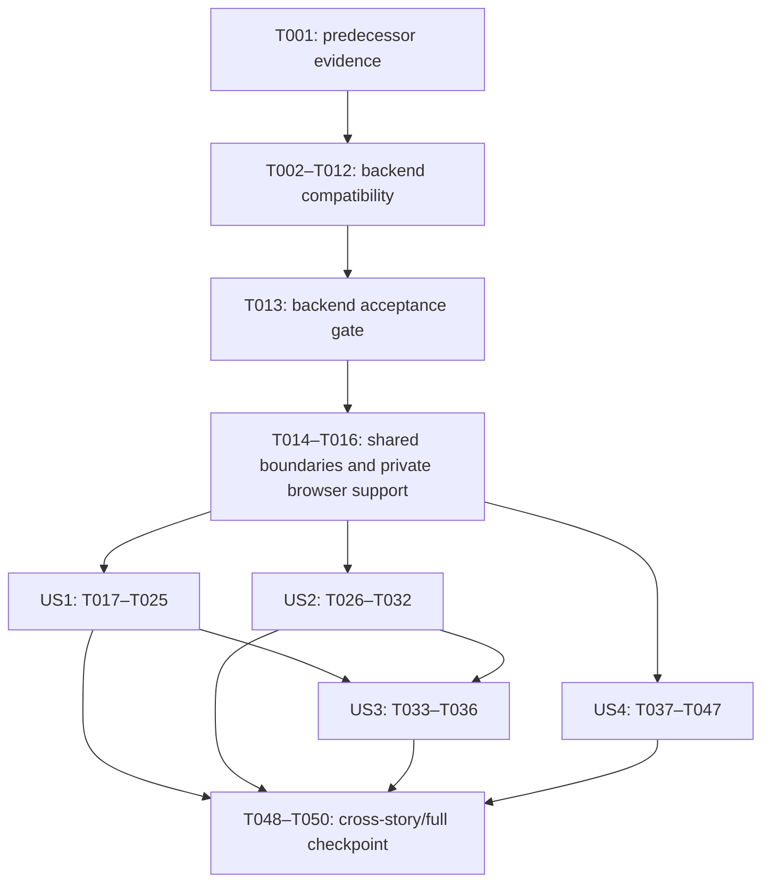

# Tasks: P09 - Withdrawal Frontend

**Roadmap Phase**: P09 - Withdrawal Frontend (legacy P12).

**Feature Directory**: `specs/009-withdrawal-frontend`; verified against `.specify/feature.json` and `spec.md`. The current Git checkout remains `008-withdrawals-payout-recovery`.

**Input**: [Spec](spec.md), [plan](plan.md), [research](research.md), [data model](data-model.md), [contract](contracts/withdrawals.md), [validation guide](quickstart.md), [constitution](../../.specify/memory/constitution.md), [roadmap](../../PLAN.md) and all eight [engineering guides](../../docs/engineering/README.md).

**Implementation Scope**: Generated tasks only. No task is executed or approved here. IMPLEMENT must receive explicit task IDs or a bounded dependency-safe scope and pass its requirements-review preflight; checklist markers are read-only during implementation.

**Tests**: Required. Add/extend the actual automated files named below, using existing Vitest/Testing Library/Supertest/PostgreSQL/Playwright owners. Backend financial/admission/race evidence uses real migrated PostgreSQL; affected queue/protected recovery claims retain P08's isolated Redis/Linux boundaries. Component doubles and seeded payout states prove presentation only.

## Execution Gates and Ownership

- The [custom checklist](checklists/withdrawals.md) has 36 unapproved questions. Preserve it and the [SPECIFY checklist](checklists/requirements.md). Review is a separate, explicitly authorized IMPLEMENT preflight, not part of TASKS. CHK032 now has the concrete reused P07 observation policy in [plan.md](plan.md#scoped-reads-and-freshness); CHK035 has the definite first-dispatch rejection versus uncertain/reloaded recovery boundary in [the contract](contracts/withdrawals.md#quote-and-acceptance-observation) and FR-012/014. These written dispositions supply review evidence; they do not approve either checklist item or bypass the preflight.
- Dependencies on test-authoring tasks mean the cases are authored and reviewed. Record an expected-red or absent-target result when implementation is still pending; that result is not behavior acceptance. Passing execution is mandatory at the backend/story gates.
- T013 is the complete backend compatibility gate. No dependent frontend task T014–T047 starts before it passes. Both accepted P08 groups must remain valid; recorded task completion alone does not establish current configured payout startup/inventory/admission.
- P09 changes only the approved withdrawal/account/admin surfaces, relevant wallet refresh and the three compatibility corrections. OD-001–OD-003 are the only presentation exceptions. Reuse completed P03 authentication. P10 destination replacement/restrictions/settings/final-account integration and P11 deployment/WAL/full restore/release remain excluded. No new table, migration, dependency, payout implementation, health platform or live transfer is required.
- Paths below are repository-relative. Files described as **add** are proposed. All other paths are existing owners. Shared contracts, API composition/services, transport, financial-query, each read-hook/presentation owner, context cleanup and `e2e/withdrawals.spec.ts` have one writer; do not parallelize tasks that share them. `[P]` permits only the explicitly independent pairs below once their dependencies pass.
- For every implementation batch, revisit its owning guides/source and apply `clean-code-guard`, relevant `security-best-practices`, and `test-guard`; apply `vercel-react-best-practices` and installed Next guidance for web changes, `playwright` for browser verification, and `docs-guard` for documentation. Fix in-scope findings before completion. Record commands/results and unavailable infrastructure in `quickstart.md`; passing format or planned tests never establishes acceptance.

## Phase 1: Selected P09 Prerequisites

**Purpose**: Reuse accepted foundations and establish the bounded implementation inputs; no toolkit, project or constitution setup.

- [x] T001 Revalidate both P08 predecessor records and affected-source scope against `specs/008-withdrawals-payout-recovery/quickstart.md` final T079–T080 acceptance; record reused versus required fresh PostgreSQL/Redis/Linux/configured-startup evidence and manifest-backed commands in `specs/009-withdrawal-frontend/quickstart.md`. Preserve separately authorized Nile evidence, current false readiness and unmet infrastructure gates; do not start a new live transfer.

## Phase 2: Backend Compatibility and Shared Integration Foundations

**Purpose**: Complete and test the three bounded backend corrections before any dependent frontend wiring, then establish the shared P09 consumers.

### Compatibility contracts and producers

- [x] T002 [P] Extend `packages/contracts/src/account/account.schema.test.ts`, `packages/contracts/src/wallet/wallet.schema.test.ts` and `packages/contracts/src/withdrawals/withdrawal.schema.test.ts` for boolean readiness, nullable configured network, unchanged identity projection, separate admin identity/availability and strict keyed outcomes; reject privileged/unknown fields, wrong bindings and contradictory money/state data. (Depends on T001.)
- [x] T003 [P] Extend `apps/api/src/core/config/tron.config.test.ts` for absent versus valid public payout capability and malformed UUID/network/token metadata, proving the public parser does not require signer credentials or filesystem configuration. (Depends on T001; independent of T002.)
- [x] T004 Update `packages/contracts/src/withdrawals/withdrawal.schema.ts`, `packages/contracts/src/wallet/wallet.schema.ts` and `packages/contracts/src/index.ts` with the planned status/admin/outcome shapes. Keep identity dependencies acyclic: define the unchanged safe `employeeFinancialIdentitySchema` projection in existing `packages/contracts/src/account/account.schema.ts`, import/re-export it through the wallet owner, and consume it from withdrawals. Preserve current public names, employee DTOs and base command results. (Depends on T002.)
- [x] T005 Add optional validated public-only payout capability parsing in `apps/api/src/core/config/tron.config.ts` and explain its actual existing configuration inputs in `.env.example`; absent capability disables requests, malformed configured input fails configuration, and the new public parser neither loads nor requires protected credential/provider/filesystem settings. Preserve the existing protected parsers; do not refactor unrelated configuration. (Depends on T003, T004.)
- [x] T006 Extend `apps/api/src/modules/custody/runtime-control.ts` with a read-only current-API-boot admission projection and add `apps/api/src/modules/withdrawals/withdrawal-readiness.ts` for the shared configured-capability/current-generation/no-fence/no-pause predicate. Reuse existing authority/locks; preserve mutation and signer guards, and propagate unexpected read failures. (Depends on T005.)
- [x] T007 Inject that safe capability through `apps/api/src/server.ts`, `apps/api/src/app.ts` and `apps/api/src/router.ts`; integrate consistent status/network/wallet/quote/first-acceptance readiness in `apps/api/src/modules/withdrawals/withdrawals.service.ts`, `apps/api/src/modules/withdrawals/withdrawal-quote.service.ts`, `apps/api/src/modules/withdrawals/withdrawal-reservation.service.ts`, `apps/api/src/modules/wallets/wallets.service.ts` and `apps/api/src/modules/wallets/wallets.mapper.ts`. Place first-write checks after existing committed-request detection, retain admission locks, saved destination networks and authorized outcome/history reads, and keep funding/restrictions/active-state eligibility separate. Update explicit safe capability injection in `apps/api/src/modules/withdrawals/testing/withdrawal-reservation-fixtures.ts` before dependent suites; never use blanket true readiness. (Depends on T006.)
- [x] T008 Add separate administrator selections/projections in `apps/api/src/modules/withdrawals/withdrawals.service.ts` and `apps/api/src/modules/withdrawals/withdrawals.mapper.ts`: current safe employee identity plus SCHEDULED/no-attempt/current-mutation-admission/supported-counter flags. Pause alone permits safe scheduled administration; a null TxID does not prove safety. Preserve employee projections/base command results and avoid directory lookups or N+1 reads. (Depends on T007.)
- [x] T009 Implement exact read-only admin action observation in `apps/api/src/modules/withdrawals/withdrawals.routes.ts`, `apps/api/src/modules/withdrawals/withdrawals.controller.ts`, `apps/api/src/modules/withdrawals/withdrawals.service.ts` and `apps/api/src/modules/withdrawals/withdrawals.mapper.ts`: strict query and current ADMIN authority, RepeatableRead lookup by existing actor/kind/key uniqueness independent of latest100 history, target/version binding and COMMITTED/NOT_OBSERVED/SUPERSEDED variants. Map only safe saved action/current request facts; no writes, new persistence or side effects. (Depends on T008.)
- [x] T010 Align `apps/api/src/infrastructure/openapi/openapi.ts` and extend `apps/api/src/infrastructure/openapi/openapi.test.ts` for readiness/status/admin projections and the new outcome read, using shared schemas and actual route/status/error/authorization semantics. (Depends on T009.)

### Real backend acceptance

- [x] T011 Extend `apps/api/src/modules/withdrawals/withdrawals-http.integration.test.ts` and `apps/api/src/modules/wallets/wallet-projections.integration.test.ts` against migrated PostgreSQL for matching readiness/network views, disabled first writes, independent eligibility, pause/fence read access, admin projection privacy and exact original action observation beyond latest100. Cover wrong role/owner/actor/key/target/version, unexpected DB errors and zero observation side effects. (Depends on T010.)
- [x] T012 Extend `apps/api/src/modules/withdrawals/withdrawals-concurrency.integration.test.ts`, `apps/api/src/modules/withdrawals/withdrawal-reservation.integration.test.ts` and `apps/api/src/modules/withdrawals/withdrawal-cancellation.integration.test.ts` for pause/acceptance and claim/admin races, replay, stale facts and source-identical one-effect release. Add original-quote outcome observation waiting on acceptance across expiry: a stale RepeatableRead snapshot plus later clock must never report EXPIRED_UNCOMMITTED for a committed winner. Use separate real connections and barriers; preserve fixture guards and inspect final ledger/source/reservation/action state. Missing or failing overlap proof blocks T013 and requires correction in the existing `apps/api/src/modules/withdrawals/withdrawals.service.ts` outcome owner before relying on that disposition; do not invent a new protocol. (Depends on T011.)
- [x] T013 Pass and record the backend compatibility gate in `specs/009-withdrawal-frontend/quickstart.md`: schema/config/OpenAPI/real HTTP-wallet/race checks including acceptance/expiry-overlap outcome proof, affected P08 reservation/calendar/scheduler/payout/settlement/recovery regressions, current isolated protected configured startup/key-policy/inventory/admission evidence, fresh owning API build where built Linux output is used, owning contracts/API lint and type checks, existing web consumer type compatibility, build-output verification and applicable security/code/test/docs review. Reuse unchanged Nile evidence explicitly; missing required evidence keeps the gate incomplete and frontend controls disabled. (Depends on T002–T012.)

### Shared frontend boundaries and private browser support

- [x] T014 Extend `apps/web/src/services/api/api-client.ts`, `apps/web/src/services/api/safe-error.ts`, `apps/web/src/services/api/api-client.test.ts` and `apps/web/src/services/api/safe-error.test.ts` for withdrawal private-read classification, safe codes/editable field allowlists and denial handling. Prove no withdrawal POST enters automatic 401/offline replay and no raw proof/private payload reaches retained errors. Preserve existing auth/deposit/purchase/manual-credit behavior. (Depends on T013.)
- [x] T015 Extend `apps/web/src/shared/query/financial-query.ts` and `apps/web/src/shared/query/financial-query.test.ts` with small P09 keys/read/page/retirement/refresh/observation helpers, normalized employee25/admin10 scopes and current-authority cancellation. Reuse the plan's 20-cycle P07 policy: immediate first read, 5/10/20/30/60-second capped backoff, coalescing, no automatic query retries/fetch bypass and focus/reconnect resume. Explicit authorized user or one-shot newly confirmed/observed persisted-outcome refresh resets through the same owner alongside invalidation, deduplicated by identity/version; unchanged polls/countdowns/rerenders cannot reset. Cover refresh after exhaustion, stop/pause/exhaustion, count/backoff across checks/remounts/query-entry garbage collection and recreation within the same QueryClient, preserved uncertainty/drafts/command guards and no financial retry or per-second network countdown. (Depends on T014 and supported CHK032 review.)
- [x] T016 Add private `apps/api/tests/e2e/p09-withdrawals.ts` and `apps/web/e2e/support/p09-withdrawals.ts`; minimally extend existing `apps/api/tests/e2e/control.ts`, `apps/api/tests/e2e/server.ts` and `apps/web/e2e/support/fixtures.ts` for validated disposable-DB IPC setup/inspection, address-confirm URL, explicit public capability/current API admission, captured email and supported service clock controls. Keep test controls outside HTTP/production builds, preserve P08 fixture isolation, and allow safe error sources for `withdrawals.spec.ts`. No worker/signer is added. (Depends on T013, T015.)

**Checkpoint**: T013 must pass before T014 onward. Shared foundations enable story work only within its additional dependencies; seeded lifecycle support is not payout acceptance.

## Phase 3: User Story 1 - Review and Reserve a Withdrawal (P1)

**Goal**: Review authoritative quote terms and reserve gross once with safe recovery and refresh.

**Independent test**: With a confirmed destination and funded account supplied through isolated setup, 100 gross at initial terms persists as 100 reserved/21 fee/79 net across reload; two contexts and a genuinely lost command reply produce one request/reservation. Unsupported input, stale facts and unresolved original intent never create a replacement. US2's entry UI is not required for this isolated story test.

### Tests and implementation

- [x] T017 [P] [US1] Add `apps/web/src/features/employee/api/withdrawals.api.test.ts` for all employee status/destination/quote/accept/outcome/history/detail/proof boundaries: unknown or malformed bodies, exact money and identifiers, 201/200/replay agreement, cancellation and no secret retention. (Depends on T014, T015; independent of admin adapter tests T037.)
- [x] T018 [P] [US1] Add `apps/web/src/features/employee/api/withdrawals.api.ts` using central transport/shared parsing for those existing employee endpoints, forwarding read AbortSignal and enforcing requested quote/resource/page identity and mixed command statuses. Keep credential consumption available through a cache-free call. (Depends on T017; independent of T038.)
- [x] T019 [P] [US1] Add `apps/web/src/features/employee/hooks/withdrawals.hooks.test.tsx` using fresh real QueryClients for scoped status/destination/list/detail, employee25 paging, denial/late-response retirement and relevant wallet/ledger/eligibility invalidation. (Depends on T018, T015.)
- [x] T020 [US1] Add `apps/web/src/features/employee/hooks/withdrawals.hooks.ts` as the single employee read/freshness owner, reusing `useFinancialScope`, validated adapters and shared P09 helpers. Preserve empty/error/out-of-range distinctions and refresh confirmed server facts without optimistic money or whole-cache clearing. (Depends on T019.)
- [x] T021 [US1] Add `apps/web/src/features/employee/hooks/withdrawal-command.hooks.test.tsx` for double callers, remount/reload, offline/storage failure, lost/malformed/obsolete replies, exact original quote observation and current-scope completion. Cover COMMITTED/live NOT_OBSERVED/EXPIRED_UNCOMMITTED, locally proven no-send and the contract's exact definite first-dispatch rejection allowlist. Prove guard/handle retirement and fresh review only with no prior uncertainty; wrong code/status/scope, earlier unresolved dispatch, generic/5xx errors, opaque reload and failed handle retirement must remain blocked. (Depends on T020 and supported CHK035 review.)
- [x] T022 [US1] Add `apps/web/src/features/employee/utils/withdrawal-command-runtime.ts` and `apps/web/src/features/employee/hooks/withdrawal-command.hooks.ts`: persist only validated actor-scoped opaque quote/key identity before dispatch and retain pending guards beyond dialog dismissal. Apply the contract's proven no-send/definite first-dispatch rejection retirement boundary; preserve drafts and require fresh authoritative eligibility/quote review. Uncertain or opaque reloaded attempts observe the original quote before another attempt; later errors never erase prior uncertainty. Refresh relevant projections on confirmed outcomes, keep financial mutations explicitly unretried/unparked offline and never infer refund/failure. (Depends on T021.)
- [x] T023 [P] [US1] Add `apps/web/src/features/employee/components/withdraw/withdrawal-form.test.tsx` for text precision/normalization, inclusive bounds, saved rate/exact quote review, funding/readiness/all-active blockers, pending confirmation, stale re-review, dirty draft retention and no optimistic reservation. (Depends on T020, T022.)
- [x] T024 [P] [US1] Add focused exact display/input transforms in `apps/web/src/features/employee/utils/withdrawal-presentation.ts` and wire `apps/web/src/features/employee/components/withdraw/withdrawal-form.tsx` to the real hooks and existing confirmation sheet. Replace local timer/context acceptance and fee authority; preserve OD-002-only truthful copy, current eligibility and guarded handlers. (Depends on T023; may pair with T031 after all shared hooks settle.)
- [x] T025 [US1] Add the US1 real-HTTP journeys to `apps/web/e2e/withdrawals.spec.ts`: funded confirmed-destination review, precision/source eligibility, definite stale rejection followed by fresh explicit review, reload, competing contexts and acceptance whose real response is suppressed only after execution. Inspect zero effect for the stale attempt and one saved request/reservation/ledger effect for accepted or recovered intent; run focused US1 adapter/hook/form/browser checks and record results in `specs/009-withdrawal-frontend/quickstart.md`. (Depends on T016, T024.)

**Checkpoint**: US1's current scope is accepted only with passing focused tests and real persisted acceptance evidence. UI success alone does not complete the story or phase.

## Phase 4: User Story 2 - Confirm the First Withdrawal Destination (P1)

**Goal**: Explicitly confirm the latest bound initial address using the existing withdrawal/account flow and private transient proof ownership.

**Independent test**: From UNSET, exact address/configured-network review issues a pending proof; merely opening its link saves nothing. Explicit matching-account confirmation persists in both sections after reload. Expired/superseded/replayed/wrong-account links remain ineffective; signed-out flow discards the proof and succeeds only after reopening the latest email following login.

### Tests and implementation

- [x] T026 [P] [US2] Add `apps/web/src/features/employee/hooks/use-withdrawal-destination-link.test.tsx` for fragment scrub before protected redirect, same-route hashchange, no automatic consume, Strict Mode/teardown/pagehide/session disposal, signed-out reopening and zero proof retention in caches/storage/navigation/diagnostics. (Depends on T018, T020; may pair with T023 after T020/T022 and both tasks' own prerequisites pass.)
- [x] T027 [US2] Add private cache-free `apps/web/src/features/employee/hooks/use-withdrawal-destination-link.ts` and nonvisual `apps/web/src/features/employee/components/withdraw/withdrawal-destination-boundary.tsx`; mount only that boundary immediately outside ProtectedRoute in `apps/web/src/app/employee/(app)/layout.tsx`. Preserve native history/router state, scrub recognized account-route fragments before passive navigation, expose only safe flow state/actions and consume only on explicit currently authorized confirmation. Observe destination after a lost consume reply; retain no credential across login/account switch. (Depends on T026.)
- [x] T028 [US2] Extend `apps/web/src/features/employee/hooks/withdrawals.hooks.test.tsx` for issue/resend pending/expiry/version/delivery states, uncertain saved-version observation, confirmed-destination eligibility refresh and obsolete account responses. Keep proof-bearing consume tests owned by T026. (Depends on T020, T027.)
- [x] T029 [US2] Extend the single owner `apps/web/src/features/employee/hooks/withdrawals.hooks.ts` with non-secret issuance/resend and destination-observation lifecycle, preserving cooldown/expiry from server facts, version binding and no automatic command replay. Coordinate safe confirmation results with the private link owner; never put the credential in Query mutation variables/context/meta. (Depends on T028.)
- [x] T030 [P] [US2] Add `apps/web/src/features/employee/components/withdraw/withdrawal-address-card.test.tsx` and extend `apps/web/src/features/employee/components/account/account-screen.test.tsx` for exact address/network sheet review, inline pending/resend/results, truthful acknowledgement/uncertainty, explicit consumption, fixed confirmed copy and missing/incompatible-network safety. (Depends on T027, T029.)
- [x] T031 [P] [US2] Wire `apps/web/src/features/employee/components/withdraw/withdrawal-address-card.tsx` and only the destination section of `apps/web/src/features/employee/components/account/account-screen.tsx` to the existing sheet/private confirmation and current destination hooks. Apply only OD-001 presentation; confirmed employee replacement remains unavailable and unrelated account behavior stays intact. (Depends on T030; independent of T024 after T029 settles.)
- [x] T032 [US2] Extend `apps/web/e2e/withdrawals.spec.ts` with first-address issuance/resend/expiry/supersession, no-write link opening, explicit consume/lost-reply observation, reload, wrong-account and signed-out reopen journeys. Inspect destination persistence and absence of secret fragments in retained navigation/cache/reporting; run focused US2/link/account/browser checks and record evidence in `specs/009-withdrawal-frontend/quickstart.md`. (Depends on T025, T031; one sequential browser-file writer.)

## Phase 5: User Story 3 - Follow Scheduled and Uncertain Payment States (P1)

**Goal**: Show authoritative lifecycle, financial disposition, counted schedule and bounded history without browser-authored payment transitions.

**Independent test**: Saved requests in all nine states show immutable recipient/terms, true reservation/settlement/release and server counted time. Friday12 Baghdad plus72 counted hours is Wednesday12; weekends add zero, extensions change the current deadline and zero never means paid. History/refresh/reload remain scoped. Seeded in-flight/final states prove presentation only.

### Tests and implementation

- [x] T033 [P] [US3] Add `apps/web/src/features/employee/components/withdraw/withdrawal-status-card.test.tsx` for all nine states/five active blockers, original/current deadlines/dispatch/remaining snapshot, fixed recipient/money/source/audit details, terminal release/zero fee/no cooldown, inline disclosures and employee25 history navigation/error/out-of-range states. (Depends on T020, T024.)
- [x] T034 [US3] Wire `apps/web/src/features/employee/components/withdraw/withdrawal-status-card.tsx` and `apps/web/src/features/employee/components/withdraw/withdraw-screen.tsx`, extending only the existing `apps/web/src/features/employee/utils/withdrawal-presentation.ts` owner as needed. Use persisted lifecycle and server counted snapshots, add OD-003-only inline details/Previous/Next/page/count, and retire fixture-derived active/history/countdown state without creating a detail route. (Depends on T024, T031, T033.)
- [x] T035 [US3] Extend `apps/web/src/features/employee/hooks/withdrawals.hooks.test.tsx` and the status-card test for external admin/payout changes, expiry continuation, UNKNOWN retention, versioned refresh/eligibility, late pages, background/resume and bounded observation stop/restart/exhaustion. Adjust only the existing read-hook owner if evidence exposes a gap; timeout/lease/countdown cannot release money. (Depends on T029, T034, T015.)
- [x] T036 [US3] Extend `apps/web/e2e/withdrawals.spec.ts` with real request schedule/read/history/wallet refresh and controlled Baghdad weekend/extension cases; separately label seeded lifecycle/expiry/disposition presentation. Retain P08's real protected claim/finality/recovery evidence rather than claiming the browser clock advances payout. Run focused US3/browser checks and record boundaries/results in `specs/009-withdrawal-frontend/quickstart.md`. (Depends on T032, T035.)

## Phase 6: User Story 4 - Inspect and Change Safely Scheduled Requests (P2)

**Goal**: Search/read real requests and safely extend/reject only admitted unsent SCHEDULED requests with current version, reason, confirmation and exact outcome recovery.

**Independent test**: An admin observes matching employee/current detail, extends by a supported positive fractional duration or rejects once with exact source release; stale/version/claim races preserve one allowed winner. A lost command reply is identified by its exact key even outside latest100 history; all unsafe states remain read-only and no manual/held action is available.

### Tests and implementation

- [x] T037 [P] [US4] Add `apps/web/src/features/admin/api/withdrawals.api.test.ts` for enriched admin10 list/detail, extension/rejection/base command results and keyed outcomes, including malformed/private data, wrong target/key/version/result, cancellation and safe errors. (Depends on T014, T015; independent of T017.)
- [x] T038 [P] [US4] Add `apps/web/src/features/admin/api/withdrawals.api.ts` using central transport/shared contracts and exact requested resource/key/version checks; preserve base write results and refetch enriched reads. (Depends on T037; independent of T018.)
- [x] T039 [P] [US4] Add `apps/web/src/features/admin/hooks/withdrawals.hooks.test.tsx` for server filters/admin10 pages, matching identity/detail, current server safe flags, denial/late-row retirement, settled out-of-range recovery and dirty draft preservation. (Depends on T038, T015.)
- [x] T040 [US4] Add `apps/web/src/features/admin/hooks/withdrawals.hooks.ts` and focused `apps/web/src/features/admin/utils/withdrawal-presentation.ts` for enriched current reads, scoped refresh/counts and safe action presentation; a list placeholder or null TxID never authorizes a command. (Depends on T039.)
- [x] T041 [US4] Add `apps/web/src/features/admin/hooks/use-withdrawal-action.test.tsx` for immutable actor/target/kind/key/version/body intent, pending dismissal/remount/reload, exact COMMITTED/NOT_OBSERVED/SUPERSEDED observation, changed-intent conflicts, original-body-only manual retry and no automatic retry/double extension/release. (Depends on T040.)
- [x] T042 [US4] Add `apps/web/src/features/admin/utils/withdrawal-command-runtime.ts` and `apps/web/src/features/admin/hooks/use-withdrawal-action.ts` with minimal opaque recovery identity/non-secret fingerprint, original reason/hours in private memory only, current detail/version/authority guards and exact outcome observation. Missing reproducible intent after reload permits observation only; supersession requires fresh review rather than claiming own success. (Depends on T041.)
- [x] T043 [P] [US4] Add `apps/web/src/features/admin/components/withdrawals/withdrawals-screen.test.tsx` for search/filter/admin10/detail scope, current identity/actor/time/reason, safe SCHEDULED-only actions, in-flight/unknown readonly states and absence of manual-completion/held/unsafe-rejection controls. (Depends on T040, T042.)
- [x] T044 [US4] Wire `apps/web/src/features/admin/components/withdrawals/withdrawals-screen.tsx` and `apps/web/src/features/admin/components/withdrawals/withdrawal-row.tsx` to current hooks/detail and existing dialogs; retire OD-002 manual Complete/held Release/dialog/filter/unsafe processing Reject wiring. Show required OD-003 inline details/countdown from server facts, keeping search/table/navigation and unrelated presentation. (Depends on T043.)
- [x] T045 [P] [US4] Add `apps/web/src/features/admin/components/withdrawals/extend-schedule-dialog.test.tsx` for shared positive-counted-hours string validation, supported fractional values, blank/oversized reason, exact version/confirmation, pending protection, stale review and preserved dirty drafts. Assert truthful proposed added hours/current deadline instead of elapsed/cumulative predictions. (Depends on T040, T042; independent of T043.)
- [x] T046 [US4] Wire `apps/web/src/features/admin/components/withdrawals/extend-schedule-dialog.tsx` and existing rejection-dialog usage in `apps/web/src/features/admin/components/withdrawals/withdrawals-screen.tsx` to reviewed current detail, strict reason/version and guarded actions. Preserve existing dialog design; replace elapsed/parseInt/cumulative previews with exact added duration and authoritative returned schedule, without a preview endpoint. (Depends on T044, T045.)
- [x] T047 [US4] Extend `apps/web/e2e/withdrawals.spec.ts` with actual HTTP extension/rejection and persisted one-effect/source release, exact keyed reply-loss recovery, real HTTP stale-version conflicts and readonly display/HTTP denial against separately seeded claimed/in-flight states. Actual claim-versus-admin race proof remains T012/P08; never bypass protected claim guards or imply a browser clock starts payouts. A suppressed reply must follow real request execution; run focused admin/API/hook/UI/browser checks and record evidence in `specs/009-withdrawal-frontend/quickstart.md`. (Depends on T036, T046; one sequential browser-file writer.)

## Phase 7: Cross-Story Cleanup and P09 Acceptance

- [x] T048 Inspect migrated callers and remove only orphaned withdrawal demo actions/types/imports from `apps/web/src/features/employee/context/employee-state.context.tsx`, `apps/web/src/features/employee/context/employee-state.types.ts`, `apps/web/src/features/employee/context/actions/use-employee-wallet-actions.ts`, `apps/web/src/features/admin/context/admin-state.context.tsx`, `apps/web/src/features/admin/context/admin-state.types.ts` and `apps/web/src/features/admin/context/actions/use-withdrawal-actions.ts`. Deliberately migrate affected `apps/web/src/features/employee/context/employee-state.context.test.tsx`, `apps/web/src/features/admin/context/admin-state.context.test.tsx` and `apps/web/src/features/admin/context/admin-financial-actions.test.tsx` assertions to real feature ownership; preserve global providers, unrelated fixtures and P10 consumers. (Depends on T025, T032, T036, T047.)
- [x] T049 Finish cross-story isolation/failure and phone/desktop journeys in `apps/web/e2e/withdrawals.spec.ts`: authority revocation/account/resource changes, malformed/read/empty/out-of-range feedback, dirty drafts, observation exhaustion/restart, proof privacy and 320/390/430px RTL/Cairo/keyboard/focus/long exact values. Use the existing `apps/web/playwright.config.ts` reporting policy; unexpected console errors/unauthorized requests fail, and explicit visual evidence masks private data. Compare against approved UI plus OD-001–OD-003 and record results in `specs/009-withdrawal-frontend/quickstart.md`. (Depends on T048.)
- [x] T050 Run a fresh `pnpm --filter @template/api build` before the complete current P09 checkpoint from verified manifests: `pnpm verify`, both API/web E2E type profiles and the full web browser suite; inspect schema-writing formatting against unrelated edits first. Review final in-scope code/security/React/test/docs and UI-preservation findings, then record actual fresh/cached/unrun results and remaining gates in `specs/009-withdrawal-frontend/quickstart.md`. Preserve no-2FA/admin-host residual risks and P11 release boundaries; missing evidence leaves P09 incomplete. (Depends on T049.)

## Dependencies and Execution Order

Internal Phase headings are task groups within P09. They do not create roadmap phases or authorize execution.



Individual task dependencies override the coarse graph. In particular:

- T002/T003 can be authored together after T001; contract/config/financial producer changes then proceed sequentially through T013.
- US1 and US2 reuse the one employee adapter/read-hook owner T018/T020. T028/T029 changes that hook sequentially; T035 follows it. T024 and T034 share employee presentation ownership and are sequential. T034 composes the ready request/address children.
- US4 adapter/read/command work may proceed beside employee work after shared prerequisites, within the selected IMPLEMENT scope. Its financial backend was already accepted at T013.
- Browser file edits are serialized T025 → T032 → T036 → T047 → T049. Their production-code prerequisites can proceed independently where explicitly allowed. Evidence writes to `quickstart.md` also have one writer.
- T048 follows all stories, and T050 follows final focused/visual/browser acceptance. A limited batch or US1 MVP never completes P09.

### Safe parallel examples

These pairs require both tasks' listed predecessors to pass and exclusive ownership of the named files. They are examples, not permission to skip earlier gates.

| Story / group   | Independent pair                                                          | Boundary                                                                                                   |
| --------------- | ------------------------------------------------------------------------- | ---------------------------------------------------------------------------------------------------------- |
| Foundation      | T002 contract tests + T003 config tests                                   | Distinct contract/API test files after T001.                                                               |
| US1             | T017 employee adapter tests + T037 admin adapter tests; later T018 + T038 | Backend/shared contracts/transport are stable; each feature adapter has one writer.                        |
| US1 / US4 reads | T019 employee read-hook tests + T039 admin read-hook tests                | Both adapters/shared helpers are stable; distinct feature test files.                                      |
| US2             | T026 private-link tests + T023 form tests                                 | T020/T022 and each task's own predecessors are satisfied; link and form test files are distinct.           |
| US1 / US2 forms | T023 form tests + T030 address/account tests                              | Shared employee hook/link/command dependencies have passed; distinct component test files.                 |
| US3             | T033 status/history tests + T043 admin screen tests                       | Common feature hooks are stable; no shared presentation or browser-file edits.                             |
| US4             | T043 admin screen tests + T045 extension-dialog tests                     | Read/action contracts are stable and files are distinct.                                                   |
| Employee UI     | T024 form wiring + T031 address/account wiring                            | T029 and all individual prerequisites are complete; shared hooks/presentation are not concurrently edited. |

## Requirement Coverage

| Spec requirements      | Owning tasks / evidence                                                                                                     |
| ---------------------- | --------------------------------------------------------------------------------------------------------------------------- |
| FR-001–FR-003          | T001–T016, T020–T025, T039–T047; backend gate before frontend, server authority and no fixture fallback.                    |
| FR-004–FR-007          | T017–T020, T026–T032, T049; initial destination/proof privacy and immutable confirmed destination.                          |
| FR-008–FR-012          | T002–T007, T011–T013, T017–T025; exact server quote/funding/fee/input/stale review.                                         |
| FR-013–FR-015          | T011–T013, T019–T025, T035–T036; uniqueness, uncertain acceptance and scoped refresh.                                       |
| FR-016–FR-020          | T008, T011–T013, T033–T036, T039–T047; nine states, saved terms, source disposition, Baghdad time and bounded history.      |
| FR-021–FR-023          | T002–T013, T037–T047; safe scheduled commands, exact recovery and audit/races.                                              |
| FR-024–FR-026          | T014–T015, T019–T022, T026–T029, T035, T039–T042, T049; errors, authority retirement, dirty drafts and bounded observation. |
| FR-027                 | T023–T024, T026–T034, T043–T049; OD-only presentation, RTL/exact details/accessibility.                                     |
| FR-028 / SC-001–SC-009 | Actual test-file tasks throughout, story browser gates T025/T032/T036/T047, final T049–T050 and `quickstart.md` evidence.   |

## Verification Commands and Evidence

Commands below are planned, not run by TASKS. Use the full owner list and boundary scenarios in [quickstart.md](quickstart.md); narrow package-relative filters to the changed files. Existing integration/E2E setup owns disposable migrated PostgreSQL. Do not reset a developer database, add another runner or weaken P08 fixture guards.

Before direct API/browser runs, build the existing dependencies; build the API freshly before a protected built-output acceptance check:

```powershell
pnpm --filter @template/contracts build
pnpm --filter @template/database build
pnpm --filter @template/api build
```

Representative focused backend/shared checks for T013–T015:

```powershell
pnpm --filter @template/contracts lint
pnpm --filter @template/contracts check-types
pnpm --filter @template/api lint
pnpm --filter @template/api check-types
pnpm --filter @template/web check-types
pnpm verify:build-output
pnpm --filter @template/contracts test src/account/account.schema.test.ts src/withdrawals/withdrawal.schema.test.ts src/wallet/wallet.schema.test.ts
pnpm --filter @template/api test src/core/config/tron.config.test.ts src/infrastructure/openapi/openapi.test.ts
pnpm --filter @template/api test:integration src/modules/withdrawals/withdrawals-http.integration.test.ts src/modules/wallets/wallet-projections.integration.test.ts src/modules/withdrawals/withdrawals-concurrency.integration.test.ts src/modules/withdrawals/withdrawal-reservation.integration.test.ts src/modules/withdrawals/withdrawal-cancellation.integration.test.ts
pnpm --filter @template/web test src/services/api/api-client.test.ts src/services/api/safe-error.test.ts src/shared/query/financial-query.test.ts
```

Run affected existing calendar/scheduler/payout/settlement/custody recovery suites with their actual file filters and required isolated Redis/Linux infrastructure when their boundary changes; T013 records why unchanged evidence is reused. Public readiness is not a signer-health or current-inventory substitute.

The existing built Linux acceptance selector, after fresh dependency/API builds, is:

```powershell
pnpm --filter @template/api test:integration src/modules/withdrawals/payout-recovery.integration.test.ts --testNamePattern "built Linux"
```

After the named web files exist, use the employee/admin filters in [the validation guide](quickstart.md#commands-for-implementation-verification), plus these browser gates:

```powershell
pnpm --filter @template/api check-types:e2e
pnpm --filter @template/web check-types:e2e
pnpm --filter @template/web test:e2e e2e/withdrawals.spec.ts
```

T050 builds current API output before integration tests and runs the complete checkpoint:

```powershell
pnpm --filter @template/api build
pnpm verify
pnpm --filter @template/api check-types:e2e
pnpm --filter @template/web check-types:e2e
pnpm --filter @template/web test:e2e
```

`verify` includes package/integration/build checks but omits separate E2E type profiles and browser execution. Its database formatter writes `schema.prisma`; preserve unrelated edits. Required services are Docker/image access for PostgreSQL18.4 and affected P08 Redis7.4.11 checks, configured Playwright Chromium, and isolated protected Linux recovery/startup facilities where claimed. No live testnet or mainnet execution is authorized here.

## Implementation Strategy and Safe First Batch

1. Run ANALYZE next against these artifacts; resolve genuine owning-artifact gaps before implementation. REQUIREMENTS review/approval remains the IMPLEMENT preflight's responsibility.
2. After that preflight passes and the owner supplies a bounded scope, start with T001–T003. This is a safe prerequisite/test-authoring batch, not a backend or phase acceptance claim.
3. Complete T004–T013 sequentially through the tested backend gate, then T014–T016. Do not enable money controls early.
4. The smallest functional MVP is US1 T017–T025 with an already-confirmed destination supplied by isolated test setup. It requires its shared/backend dependencies and does not substitute for the user-facing US2 destination flow or whole P09 acceptance.
5. Add US2, US3 and US4 within their declared dependencies; parallelize only independent owners. Finish T048–T050 before claiming P09 completion. Stop at the selected scope; no automatic next phase, deployment, commit, push or real-money action.

**Generation boundary**: TASKS creates this file only. Every T001–T050 item remains unchecked; no test file, application behavior, checklist approval or test execution is produced by generation.

## Phase 8: Convergence

**Audit scope**: P09 only, assessed on 2026-10-10 against the current spec, plan, tasks, governing rules, source and existing execution evidence. The recorded complete checkpoint remains evidence for its tested boundaries; no tests were executed by CONVERGE. F1-F6 below are remaining partial gaps. Existing task definitions and approval markers remain unchanged. T079-T080 references above identify predecessor P08 work; the highest task definition in this feature is T050.

- [x] T051 [US1] Correct HIGH finding F1 in `apps/web/src/services/api/api-client.ts` and `apps/web/src/features/employee/utils/withdrawal-command-runtime.ts` so transport-triggered session revalidation does not prevent a strictly validated original first-dispatch `WITHDRAWAL_BLOCKED`/403 from retiring its pending guard and opaque recovery handle. Evidence: `api-client.ts:240-244` calls `beginCheck()` before `withdrawal-command-runtime.ts:138-155` evaluates the original check. Preserve real authority-change retirement, prior uncertainty, no automatic replay and failed-storage safety. Extend `apps/web/src/services/api/api-client.test.ts` and `apps/web/src/features/employee/hooks/withdrawal-command.hooks.test.tsx` with a strict Axios error through the actual adapter/runtime, rather than directly throwing a preclassified error; prove one send, successful handle retirement, preserved draft and authoritative restriction refresh, contrasted with malformed/mismatched errors, external scope changes, prior unresolved dispatch and failed retirement. Run affected transport/command/form checks and record actual results in `specs/009-withdrawal-frontend/quickstart.md` per FR-012/FR-014, plan: Quote, lifecycle and history, and T014/T021-T022 (partial).
- [x] T052 [US3] Correct HIGH finding F2 in `apps/web/src/features/employee/hooks/withdrawals.hooks.ts` so an observed active request becoming absent from status retains enough original identity to observe its authoritative terminal disposition and refresh relevant wallet/ledger/history/eligibility facts once before stopping. Evidence: `withdrawals.hooks.ts:52-59` stops pending observation and passes an empty refresh list for null, while `apps/web/src/features/employee/components/account/account-screen.tsx:40-44` mounts wallet/status without a history/detail reader. Use the existing authorized detail boundary; absence alone must not invent settlement/release. Preserve scope retirement, the bounded observation budget and version-deduplicated refresh. Extend `apps/web/src/features/employee/hooks/withdrawals.hooks.test.tsx` with status plus wallet and no history/detail consumer, covering external rejection/completion and unchanged subsequent null; also cover withdrawal history on page 2. Assert refreshed server balances/history, no optimistic money, no repeated reset and eventual observation stop. Run affected read/query/wallet checks and record results in `specs/009-withdrawal-frontend/quickstart.md` per FR-015/FR-019/FR-026, US3/AC6-7, plan: Scoped reads and freshness, and T015/T019-T020/T035 (partial).
- [x] T053 [US1] Correct HIGH finding F3 in `apps/web/src/features/employee/components/withdraw/withdrawal-form.tsx` so displayed quote fee/net belong to the current normalized draft amount; editing text or choosing a preset after dismissing review must retire or hide obsolete quote terms and require a fresh explicit review. Evidence: amount changes at lines 240/256 retain review, then lines 269-302 combine the new gross with the earlier fee/net (100/21/79 can become 200/21/79). Preserve dirty amount input, existing confirmation presentation, exact strings and server fee authority. Extend `apps/web/src/features/employee/components/withdraw/withdrawal-form.test.tsx` through typed and preset edits after dismissal, asserting no mismatched monetary tuple, no local fee recomputation and no acceptance before a matching new quote is reviewed. Run focused form/command checks and record results in `specs/009-withdrawal-frontend/quickstart.md` per FR-009/FR-010/FR-012, US1/AC1, plan: Quote, lifecycle and history, and T023-T024 (partial).
- [x] T054 [US4] Correct HIGH finding F4 in `apps/web/src/features/admin/components/withdrawals/withdrawals-screen.tsx`, `apps/web/src/features/admin/components/withdrawals/extend-schedule-dialog.tsx` and the existing rejection-dialog usage so stale-version/SUPERSEDED resolution preserves the same authorized actor/target/action's reason and extension-hours draft through fresh-detail review. Evidence: `withdrawals-screen.tsx:49-59` closes the dialog on resolution and version-based keys at lines 315/341 remount empty/default drafts (`extend-schedule-dialog.tsx:37-38`). Keep drafts in private transient memory, clear them on actual authority/resource retirement, and require fresh current detail/version plus explicit confirmation; retained drafts must never automatically retry or change an old command's immutable payload/key. Extend the existing screen/dialog/action-hook tests for both extension and rejection conflicts, then extend the real stale-write journey in `apps/web/e2e/withdrawals.spec.ts:289-321` to assert preserved drafts, newer-version review, no automatic resend and one allowed persisted winner. Run focused admin/browser checks and record results in `specs/009-withdrawal-frontend/quickstart.md` per US4/AC5, FR-023/FR-024/FR-025, plan: Admin scheduled actions, and T039/T041/T045-T047 (partial).
- [x] T055 [US4] Correct MEDIUM finding F5 in `apps/web/src/features/admin/components/withdrawals/withdrawals-screen.tsx` and `apps/web/src/features/admin/components/withdrawals/withdrawal-row.tsx` by mapping existing safe read-error categories to distinct malformed-contract versus unavailable-read feedback in the current inline list/detail surfaces. Evidence: screen lines 224-231 and row lines 22-31 currently discard those categories and show identical feedback. Preserve confirmed-denial hiding/handler protection, known data semantics, dirty drafts and the existing UI; expose no raw response/error payload or new error framework. Extend `apps/web/src/features/admin/components/withdrawals/withdrawals-screen.test.tsx` and applicable existing admin read-hook tests with malformed HTTP200, unavailable HTTP503 and actual denial cases under current scope. Run focused admin read/component checks and record results in `specs/009-withdrawal-frontend/quickstart.md` per FR-024/FR-025, plan: Scoped reads and freshness, and T039/T043-T044. Depends on T054 because both own the screen and its tests (partial).
- [x] T056 Add the missing portion of MEDIUM finding F6 to `apps/web/e2e/withdrawals.spec.ts`: exercise the expanded administrator withdrawal table/details and reachable scheduled actions at 320px with long recipient/exact monetary values, bounded table scrolling, zero page overflow, readable disclosure content and keyboard access. Evidence: lines 104-117 close the disclosure before the existing 320px extension-dialog check; expanded-table checks at lines 212-235 cover only 390/1280px. Reuse the existing real browser harness and masked visual evidence; do not redesign the table. Include focused browser regression evidence for T051-T055 where their user-visible paths apply, including external release/completion while the account wallet is mounted, edited quote review, preserved stale admin drafts and distinct read feedback. After all corrections pass applicable code/security/React/test/docs review, run a fresh API build, the full manifest-backed P09 checkpoint (`pnpm verify`, both API/web `check-types:e2e` profiles and the full web `test:e2e` suite), and record actual fresh/cached/unrun results in `specs/009-withdrawal-frontend/quickstart.md`. Missing required evidence leaves P09 incomplete. Depends on T051-T055; this is the sole final browser/evidence writer per SC-009, FR-027/FR-028, plan: Delivery Order and Validation Gates, and T049-T050 (partial).

## Phase 9: Convergence

**Audit scope**: P09 only, assessed on 2026-10-10 against current intent, governing rules, source and existing execution records. Checked 28 functional requirements, 28 acceptance scenarios, nine success criteria, 20 buildable plan obligations and seven constitution principles. F7-F9 are three partial gaps: one HIGH and two MEDIUM. Earlier T051-T056 fixes are present. The final T056 records and logs support the existing passing checkpoint (612 API integration tests, 84 database integration tests and 112 browser scenarios); no tests were executed by CONVERGE. Existing task definitions, completion and approval markers remain unchanged. These new cases are not accepted by the earlier checkpoint.

- [x] T057 [US4] Correct HIGH finding F7 in `apps/web/src/shared/query/financial-query.ts` so simultaneous P09 detail resources retain independent bounded observation windows and identical resource readers coalesce. Evidence: lines 392-406 key the window map only by namespace/role/domain and replace it on selection mismatch; `apps/web/src/features/admin/components/withdrawals/withdrawal-row.tsx:130,190` permits multiple independently expanded rows, each using `admin-detail`, while `apps/web/src/features/admin/components/withdrawals/withdrawals-screen.tsx:62` also mounts that domain for a nullable dialog target. Different readers and ordinary rerenders can replace each other's windows with count zero/immediate scheduling without an explicit refresh or new persisted transition. Preserve complete authority/domain/normalized-resource identity, the 20-completed-cycle/backoff policy, same-target coalescing, pause/stop/exhaustion, remount/query-GC retention and bounded retirement; disabled null readers must not reset another resource. Preserve P07 behavior and command-replay exclusions. Extend `apps/web/src/shared/query/financial-query.test.ts` and applicable `apps/web/src/features/admin/hooks/withdrawals.hooks.test.tsx` coverage with real QueryClients for two concurrent active detail resources, a disabled null reader, same-target sharing, ordinary rerenders/remounts, independent exhaustion/backoff, explicit refresh and authority teardown. Add a two-expanded-row regression in `apps/web/e2e/withdrawals.spec.ts`, run focused shared/admin checks, apply the owning review skills and record actual results in `specs/009-withdrawal-frontend/quickstart.md` per FR-026, plan: Scoped reads and freshness, and T015/T039-T040 (partial).
- [x] T058 [US4] Correct MEDIUM finding F8 in the existing P09 list observation owner `apps/web/src/shared/query/financial-query.ts` and, only as needed, `apps/web/src/features/admin/hooks/withdrawals.hooks.ts` so active administrator history rows on the selected page beyond page one remain observable within the same bounded policy. Evidence: `financial-query.ts:606-610` drops the pending predicate when page is not one, although `admin/hooks/withdrawals.hooks.ts:29` supplies the active-row predicate; the observer stops after the initial read and automatic focus/reconnect fetching is disabled. With no detail disclosure open, later-page schedules and lifecycle states can remain stale through external admin/payout changes. Preserve server pagination/filter scope, P07 behavior, current-authority retirement, dirty drafts and finite resource-specific budgets; do not add unconditional polling or financial retries. Extend `apps/web/src/features/admin/hooks/withdrawals.hooks.test.tsx` and the relevant shared-query tests with page-two SCHEDULED/in-flight rows, external version/deadline and terminal changes, eventual stop, hidden/offline pause/resume and exhaustion without budget reset. Add a later-page active-row browser regression in `apps/web/e2e/withdrawals.spec.ts`; run focused checks and record actual results in `specs/009-withdrawal-frontend/quickstart.md` per FR-020/FR-026, plan: Scoped reads and freshness, and T039-T040. Depends on T057 because both own the shared observer and browser/evidence files (partial).
- [x] T059 [US2] Correct MEDIUM finding F9 in `apps/web/src/features/employee/hooks/use-withdrawal-destination-link.ts` and the existing `apps/web/src/features/employee/components/withdraw/withdrawal-destination-details.tsx` feedback so a delayed matching destination confirmation resolves its private link outcome truthfully. Evidence: link-hook lines 210-222 turn a failed consume followed by a nonfinal PENDING read into `reopen`, disabling its uncertainty observer at line 144; ordinary address readers may later show CONFIRMED without repairing that state, while details lines 147-152 still display reopen/expired/wrong-account guidance beside the confirmed address. Preserve uncertainty for nondefinitive replies/observations and resolve the matching authoritative result; retain safe definitive invalid/expired/superseded/wrong-account guidance, immediate credential clearing, session/departure isolation and zero automatic consume replay. Extend `apps/web/src/features/employee/hooks/use-withdrawal-destination-link.test.tsx` and `apps/web/src/features/employee/components/account/account-screen.test.tsx` with consume response loss before commit, a first PENDING observation and later same-address/network CONFIRMED; assert one consume, bounded reconciliation, success replacing obsolete guidance and no retained proof, while preserving definitive-failure cases. Add corresponding browser response-ordering coverage in `apps/web/e2e/withdrawals.spec.ts` through the existing harness, labeling any response-boundary double honestly. Run focused link/account/browser checks. After T057-T059 corrections pass applicable code/security/React/test/docs review, run a fresh API build and the complete manifest-backed P09 checkpoint (`pnpm verify`, both API/web `check-types:e2e` profiles and the full web `test:e2e` suite); record actual fresh/cached/unrun results in `specs/009-withdrawal-frontend/quickstart.md`. Missing required evidence keeps P09 incomplete. Depends on T057-T058 to serialize the shared observation prerequisites and browser/evidence writer, per FR-005/FR-024/FR-028, US2/AC2, spec: proof-consumption uncertainty edge case, plan: Initial destination and Delivery Order and Validation Gates, and T026-T032/T049-T050 (partial).

## Phase 10: Convergence

**Audit scope**: P09 only, assessed on 2026-10-10 against current spec/plan/tasks, governing rules, source/callers/tests and existing execution evidence. Checked 28 functional requirements, 28 acceptance scenarios, nine success criteria, 20 buildable plan obligations and seven constitution principles. F10 is one MEDIUM partial gap in later destination-proof observation; the earlier T051-T059 corrections are present. The latest T059 checkpoint logs support 1,653 passing unit tests (756 web fresh; 897 API/contracts/database cached), 612 fresh API integration tests, 84 fresh database integration tests and 115 passing browser scenarios. No tests were executed by CONVERGE. Existing task definitions, checkbox/approval markers, spec, plan and feature pointer remain unchanged. The prior passing checkpoint does not cover the new regression below.

- [x] T060 [US2] Correct MEDIUM finding F10 in `apps/web/src/features/employee/hooks/use-withdrawal-destination-link.ts` so a lost consume reply followed initially by the same valid PENDING proof resolves to the existing reopen/latest-proof guidance when a later current-authority destination read proves expiry or supersession, and stops unnecessary confirmation observation. Evidence: attempt metadata at lines 38-42 omits the reviewed version; the observer at lines 141-165 treats every non-CONFIRMED result as pending and resolves only matching CONFIRMED, although the immediate fallback at lines 222-239 already recognizes invalidated pending facts. Retain the non-secret reviewed version with the private actor/attempt identity and classify later authoritative proof status/version/address/network changes consistently; use the existing feedback in `apps/web/src/features/employee/components/withdraw/withdrawal-destination-details.tsx` without adding presentation. Preserve uncertainty for unchanged valid PENDING and transient/malformed reads, the delayed matching CONFIRMED resolution, session/departure isolation, immediate credential clearing and zero automatic consume replay. Extend `apps/web/src/features/employee/hooks/use-withdrawal-destination-link.test.tsx` and `apps/web/src/features/employee/components/account/account-screen.test.tsx` for one lost consume reply, an initial same-version valid PENDING observation, then same-version EXPIRED or a newer pending proof generation: assert latest-proof guidance replaces uncertainty, observation stops, destination remains unchanged, one consume occurs and no credential is retained; retain the delayed-confirmation and authority-retirement cases. Add the corresponding controlled response-ordering regression in `apps/web/e2e/withdrawals.spec.ts` through the existing harness, labeling response-boundary fixtures honestly. Run focused link/account/query/browser checks and applicable code/security/React/test/docs review, then a fresh API build and the complete manifest-backed P09 checkpoint (`pnpm verify`, both API/web `check-types:e2e` profiles and full web `test:e2e`); record actual fresh/cached/unrun results in `specs/009-withdrawal-frontend/quickstart.md`. Missing required evidence keeps P09 incomplete. Depends on completed T057-T059; per FR-005/FR-024/FR-026/FR-028, US2/AC3-4, plan: Initial destination and Scoped reads and freshness, and T026-T032/T059 (partial).

## Phase 11: Convergence

**Audit scope**: P09 only, assessed on 2026-10-10 against current spec/plan/tasks, governing rules, actual source/callers/tests and existing execution records. Checked 28 functional requirements, 28 acceptance scenarios, nine success criteria, 20 buildable plan obligations and seven constitution principles. F11 and F12 are two partial gaps: one MEDIUM in draft retention through routine authority checks and one LOW in published readiness wording. T051-T060 corrections are present. The latest T060 checkpoint supports 1,657 passing unit tests (760 web fresh; 897 API/contracts/database cached), 612 fresh API integration tests, 84 fresh database integration tests and 117 passing browser scenarios; required P08/T013 evidence is sufficient for this bounded phase, with P11 launch/restore gates excluded. No tests were executed by CONVERGE. Existing task definitions, completion/approval markers, spec, plan and feature pointer remain unchanged. The passing checkpoint does not cover the route-composition regression below.

- [x] T061 [US1] [US4] Correct MEDIUM finding F11 at the P09 protected-route callers in `apps/web/src/app/employee/(app)/layout.tsx`, `apps/web/src/features/admin/components/common/admin-route-boundary.tsx` and, as needed, their owning withdrawal form/screen/dialog state so routine same-actor focus/online session revalidation preserves dirty employee amount and administrator extension-hours/reason drafts. Evidence: `apps/web/src/features/auth/hooks/auth.hooks.ts:130-134` begins a check without retiring actor/epoch; `apps/web/src/components/auth/protected-route.tsx:46-47,81,162` unmounts children by default while checking; employee layout line 14 omits preservation, while admin boundary line 20 enables it only for task editors. Local drafts in `withdrawal-form.tsx:52-59`, `extend-schedule-dialog.tsx:39-40` and `admin-confirm-dialog.tsx:67` are consequently discarded even after successful same-actor authorization. Admin screen selection/visibility at lines 44-66 and visible-derived dialog keys at lines 338/366 also require stable private draft ownership during temporary unavailability. Reuse the existing guard's concealed state-preservation capability narrowly for P09; do not weaken current-authority hiding/handler checks, retain credentials or store raw drafts in browser storage. Preserve drafts through pending/transient session checks, restore them only for the same authorized actor/target, and require fresh authoritative quote/detail/version plus explicit review before dispatch. Actual authority/resource retirement, definitive denial and departure must discard private state; retained drafts must never replay commands or reactivate obsolete confirmation. Extend the existing withdrawal form/admin screen tests through actual protected-parent composition (including `apps/web/src/features/employee/components/auth/employee-auth.integration.test.tsx` or a focused route-composition test where needed), then add real focus/online and transient-session-failure journeys to `apps/web/e2e/withdrawals.spec.ts`. Assert draft retention, concealed/disabled controls while checking, fresh review, no automatic command, and correct denial/account-switch/departure retirement; preserve destination-proof scrubbing and bounded observation. Run focused auth/withdrawal/query/browser regressions and applicable code/security/React/test review; record results in `specs/009-withdrawal-frontend/quickstart.md`. Depends on completed T054/T057-T060; per FR-024/FR-025/FR-026/FR-028, plan: Scoped reads and freshness, Quote lifecycle and Admin scheduled actions, and T024/T039/T045/T054 (partial).
- [x] T062 Correct LOW finding F12 in `apps/api/src/infrastructure/openapi/openapi.ts:407`: GET `/withdrawals/me` still documents that execution readiness remains false in Group A, although current status derives configured/current-boot/generation/fence/pause admission and existing real HTTP tests establish true and false outcomes. Align only the description with the actual new-request readiness predicate in `apps/api/src/modules/withdrawals/withdrawals.service.ts` and `apps/api/src/modules/custody/runtime-control.ts`; keep eligibility, accepted-request read access and signer liveness/immediate payment distinct. Do not change schemas, endpoints or financial behavior. Apply docs-guard against those sources and run the existing focused `apps/api/src/infrastructure/openapi/openapi.test.ts` checks. After this correction and T061 pass applicable review, run a fresh API build and the complete manifest-backed P09 checkpoint (`pnpm verify`, both API/web `check-types:e2e` profiles and full web `test:e2e`); record actual fresh/cached/failed/unrun results in `specs/009-withdrawal-frontend/quickstart.md`. Missing required evidence keeps P09 incomplete. Depends on T061 to serialize final browser/evidence ownership; per T010, plan: Backend Compatibility and Gate and Delivery Order and Validation Gates, FR-001/FR-028 and engineering API-contract/documentation alignment (partial).

## Phase 12: Convergence

**Audit scope**: P09 only, assessed on 2026-10-11 against current spec/plan/tasks, governing rules, actual source/callers/tests and existing execution records. Checked 28 functional requirements, 28 acceptance scenarios, nine success criteria, 20 buildable plan obligations, seven constitution principles and all 62 existing tasks. F13-F15 are three partial gaps: one MEDIUM and two LOW. Prior T051-T062 corrections are present. The recovered T062 checkpoint supports 1,660 passing unit tests (576 API fresh; 763 web, 312 contracts and nine database cached), 612 fresh API integration tests, 84 fresh database integration tests, both repeated E2E type profiles and the retained complete 120-scenario browser pass for the same application code. No tests or builds were executed by CONVERGE. Existing task definitions, completion/approval markers, spec, plan and feature pointer remain unchanged. Required P08/T013 records remain sufficient for this bounded phase; P11 launch/restore and independent release review remain separate. The earlier passing checkpoint does not cover the exhausted-observation regression below.

- [x] T063 [US1] [US3] [US4] Correct MEDIUM finding F13 in the P09 read/observation owner in apps/web/src/shared/query/financial-query.ts and, only as needed, the owning employee/admin withdrawal hooks and existing inline feedback surfaces so exhausting the 20-cycle budget preserves correctly scoped last-known display facts through routine same-actor session revalidation and query garbage collection/remount. Evidence: withdrawalQueryKey at financial-query.ts:33 includes scope.check; usePrivateRead at lines 185 and 214-215 uses gcTime:0 and exposes only the new check's query data; useBoundedObservation at line 464 retains the exhausted resource budget and schedules no replacement read. Ordinary focus/online checks in apps/web/src/features/auth/hooks/auth.hooks.ts:130-134 consequently leave apps/web/src/features/admin/components/withdrawals/withdrawals-screen.tsx:251-258 and withdrawal-row.tsx:19-31 displaying indefinite loading with the prior request facts lost. Retain only validated actor/role/epoch/domain/normalized-resource display snapshots and use existing inline stale/exhausted feedback and explicit refresh; keep protected content concealed during authority checks and hide/discard it on denial or actual authority/resource retirement. Retained snapshots must not authorize fresh quote/detail review or commands. Preserve independent/coalesced resource windows, count/backoff, zero implicit fetch after exhaustion, drafts/recovery handles, and P07 behavior; do not reset the budget on routine checks/remounts or add command replay. Extend apps/web/src/shared/query/financial-query.test.ts and applicable employee/admin withdrawal hook/component tests with real QueryClients for exhaustion followed by successful same-actor revalidation and GC/remount, preserved last-known facts, no phantom loading or implicit reads, explicit refresh recovery, stale-command blocking and denial/account-switch/resource cleanup. Add the corresponding protected-route browser regression to apps/web/e2e/withdrawals.spec.ts, run focused shared/session/withdrawal/browser checks, apply the owning code/security/React/test reviews and record actual results in specs/009-withdrawal-frontend/quickstart.md per FR-024/FR-025/FR-026, plan: Scoped reads and freshness, and T015/T019-T020/T039-T040/T057 (partial).

- [x] T064 Correct LOW finding F14 in apps/api/src/infrastructure/openapi/openapi.ts:476-489 by documenting the reachable HTTP 503 WITHDRAWAL_UNAVAILABLE response on POST /withdrawals using the existing error response/schema owner. Evidence: first acceptance fails closed when public capability/current API admission is absent or dispatch pauses in apps/api/src/modules/withdrawals/withdrawal-reservation.service.ts:65-69,166-167; apps/api/src/modules/withdrawals/withdrawals.errors.ts:33 maps that code to 503, but the acceptance response map and inherited errors at openapi.ts:194-208 omit it. Extend the existing acceptance case in apps/api/src/infrastructure/openapi/openapi.test.ts:185-191 to require 503 and the shared error envelope, apply docs-guard against the actual route/service/error mapping and run the focused OpenAPI suite plus owning checks. Change no financial behavior, endpoint or public schema. Record results in specs/009-withdrawal-frontend/quickstart.md. Depends on T063 to serialize evidence ownership, per T010, plan: Backend Compatibility and Gate, and docs/engineering/api-contracts.md section 7 (partial).

- [x] T065 Correct LOW finding F15 by removing the verified orphaned withdrawal demo chain after rechecking callers: apps/web/src/features/employee/utils/withdrawal-request.ts:8 exports unused createWithdrawalRequest; apps/web/src/features/employee/utils/ledger-transactions.ts:6,29 exports unused createWithdrawalReservationTransaction/createWithdrawalReversalTransaction; their exclusively orphaned getWithdrawalAmounts/formatLocalDateTime branches remain in apps/web/src/features/employee/utils/financial-calculations.ts:14,26. The withdrawal-only assertions in apps/web/src/features/employee/employee-arithmetic.test.ts:73-81 preserve obsolete two-decimal fee rounding. Repository-wide searches find only constructor definitions, with no production callers; this is dead fixture implementation, not an executable money defect. Remove only those orphaned files/exports/imports and obsolete test branches; preserve unrelated package calculations, fixture/P10 consumers and real financial regression assertions. Run affected employee/context tests and owning lint/types; apply clean-code-guard/test-guard/docs-guard as applicable. After T063-T065 corrections pass review, run a fresh API build and the complete manifest-backed P09 checkpoint (pnpm verify, both API/web check-types:e2e profiles and the full web test:e2e suite), and record actual fresh/cached/failed/unrun results in specs/009-withdrawal-frontend/quickstart.md. Missing required evidence keeps P09 incomplete. Depends on T063-T064 to serialize final browser/evidence ownership, per T048, plan: Source owners and Delivery Order and Validation Gates, FR-028/SC-009, and docs/engineering/code-style.md section 4 (partial).
